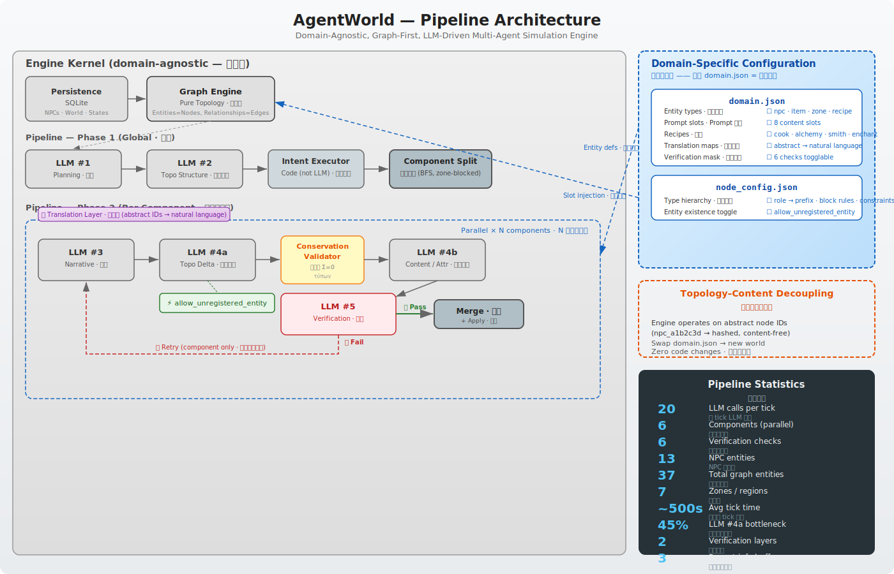
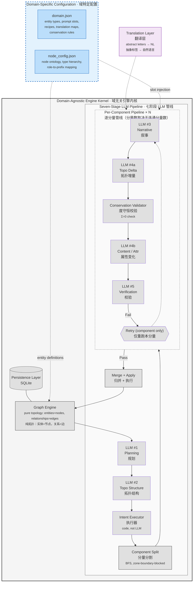
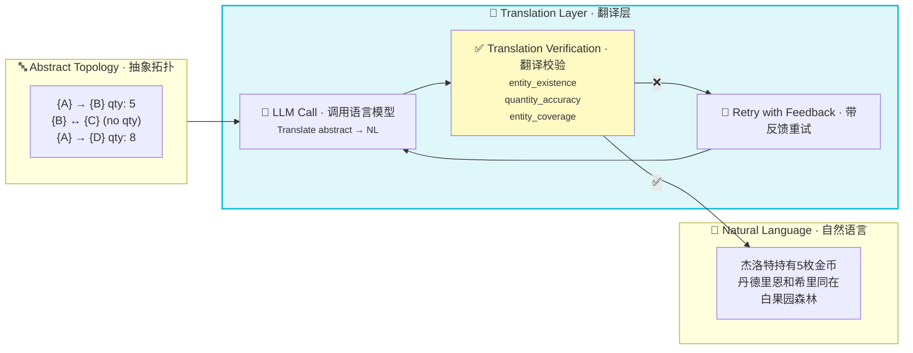
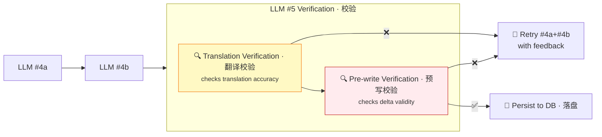
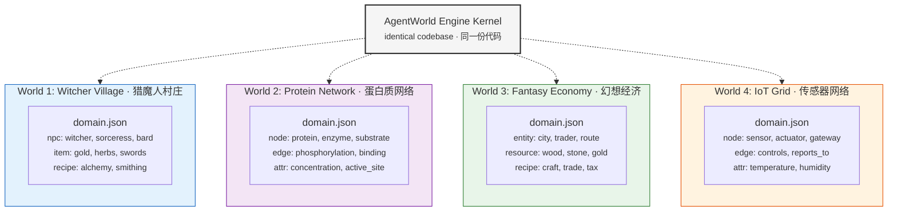

# AgentWorld

<p align="center">
  
  <br/>
  <em><b>Graph is not a feature. Graph is the system.</b></em>
  <br/>
  <em><b>图拓扑不是组件，是整个系统的骨架。</b></em>
  <br/>
  <small>✨ <b>拓扑-内容解耦</b> · 分量并行管线 · 统一 LLM 入口 · 度守恒校验 · 新增实体开关 ✨</small>
</p>

---

> **AgentWorld: A Domain-Agnostic, Graph-First, LLM-Driven Multi-Agent Simulation Engine**
>
> **EN**: The graph is the first principle — entities are nodes, relationships are edges, and LLMs reason over the topology to produce emergent behavior. **Topology–content decoupling** is the key innovation: the engine kernel operates on abstract, content-free node IDs, while all semantic knowledge lives in `domain.json`. This means swapping `domain.json` transforms the same engine into a village simulator, a protein interaction network, a fantasy economy, or an IoT sensor grid — **with zero code changes**. The system features a component-split pipeline that partitions the world by connected subgraph, enabling per-component parallel execution and isolated retry.
>
> **CN**: 图拓扑是第一性原理——实体是节点，关系是边，LLM 在拓扑之上推理产生涌现行为。**拓扑-内容解耦**是核心创新：引擎内核操作抽象的、无内容的节点 ID，所有语义知识存在于 `domain.json` 中。这意味着切换 `domain.json` 即可将同一个引擎转变为村庄模拟器、蛋白质交互网络、幻想经济或 IoT 传感器网格——**零代码改动**。系统采用分量分割管线，按连通子图划分世界，支持逐分量并行执行和隔离重试。

---

## Architecture Overview · 架构总览

> **Figure 1.  AgentWorld system architecture.** The engine kernel (gray) is domain-agnostic — it operates on abstract graph topology with no knowledge of entity semantics. All domain content lives in `domain.json` (blue), injected into the pipeline via slot-based prompt assembly. The topology-content decoupling (bold dashed line) enables cross-domain transfer: swapping `domain.json` creates a new simulation world with zero code changes.



---

### Pipeline Stage Details · 管线阶段详解

| Stage · 阶段 | Type · 类型 | Input · 输入 | Output · 输出 | Constraint · 约束强度 |
|:----------|:----------|:-----------|:------------|:-------------------|
| **#1 Plan · 规划** | LLM · 语言模型 | Entity state + topology · 实体状态+拓扑 | Natural language plan · NL 计划 | Free text · 自由文本 |
| **#2 Topo Structure · 拓扑结构** | LLM · 语言模型 | All NPC plans · 所有 NPC 计划 | `connect`/`disconnect`/`set_qty` · 结构化 JSON | JSON schema · JSON 模式 |
| **↳ Intent Executor · 执行器** | Code · 代码 | Topo ops · 拓扑操作 | Applied graph mutations · 图变更 | Deterministic · 确定性 |
| **↳ Component Split · 分量分割** | Code · 代码 | Executed graph · 执行后图 | N connected components · N 个连通分量 | BFS, zone-blocked |
| **#3 Narrative · 叙事** | LLM · 语言模型 | Translated topo + plans · 翻译后拓扑+计划 | Story per component · 逐分量故事 | Free text · 自由文本 |
| **#4a Topo Delta · 拓扑增量** | LLM · 语言模型 | Stories + graph state · 故事+图状态 | `delta`/`system_delta`/`recipe` · 结构化 JSON | JSON schema + Σ=0 |
| **↳ Conservation Validator · 守恒校验** | Code · 代码 | Delta ops | Pass / partial fail · 通过/部分失败 | Σ(delta)=0 per group |
| **#4b Content · 属性变化** | LLM · 语言模型 | Stories + topo | `attr` deltas + `recent_info` · 属性+近况 | JSON schema |
| **#5 Verification · 校验** | Code · 代码 | All outputs · 全部输出 | Pass → persist / Fail → retry component · 通过→落盘/失败→仅重跑本分量 | 6 registry checks |
| **↳ Merge · 归并** | Code · 代码 | N component results · N 个分量结果 | Aggregated operations · 归并后操作 | Deterministic |

---

## Topology–Content Decoupling · 拓扑-内容解耦

> **Figure 2.  The core design principle: topology and content are separately defined and independently evolvable.** The engine operates on abstract node IDs (e.g., `npc_a1b2c3d`) with type tags (`type_id: 2 → "npc"`) read from config. Entity names, descriptions, and semantic roles live in `domain.json`. This decoupling means the exact same engine can simulate a Witcher village, a protein interaction network, or a fantasy economy — only the config changes.

```
┌──────────────────────────────────────────────────────────────────┐
│                    AgentWorld Engine Kernel                      │
│  (domain-agnostic · 域无关)                                       │
│                                                                  │
│  entity_id: npc_a1b2c3d    type_id: 2    edges: {zone_4, ...}   │
│  └── hashed, content-free  └── config key  └── pure topology    │
│                                                                  │
│  ═══════════════════════ Decoupling Boundary ═══════════════════ │
│                         解耦边界                                   │
│                                                                  │
│  name: "杰洛特"    role: "witcher"   satiety: 45                 │
│  desc: "白发猎魔人，背负试炼的痛苦"                                   │
│  └── all from domain.json · 全部来自配置                           │
└──────────────────────────────────────────────────────────────────┘
```

### Why This Matters for Cross-Domain Transfer · 跨域迁移的意义

Traditional multi-agent simulation engines hardcode domain logic:
- A "village simulator" can't simulate protein folding without rewriting core code
- A "fantasy economy" engine can't simulate an IoT sensor network

AgentWorld's decoupling eliminates this: the engine never inspects entity content.

| Domain · 域 | domain.json content · 配置内容 | Engine changes · 引擎改动 |
|:-----------|:-----------------------------|:------------------------|
| 🏘️ **Witcher village** · 猎魔人村庄 | NPCs: 杰洛特/叶奈法/希里; Items: 金币/草药/剑; Zones: 维吉玛/Oxenfurt | **Zero** · 零改动 |
| 🧬 **Protein network** · 蛋白质网络 | Nodes: proteins/reactions; Edges: phosphorylation binding; Attributes: concentration, activation state | **Zero** · 零改动 |
| 🌾 **Fantasy economy** · 幻想经济 | Entities: cities/trade routes/resources; Recipes: craft/smith/gather | **Zero** · 零改动 |
| 🌡️ **IoT sensor grid** · IoT 传感器 | Entities: sensors/actuators/gateways; Attributes: temperature, humidity; Relationships: controls/reports-to | **Zero** · 零改动 |

The engine's verification layer, conservation rules, and component split are all type-config-driven. Adding a new domain is purely a configuration exercise.

引擎的校验层、度守恒规则、分量分割全部由类型配置驱动。新增域纯属配置工作。

---

## 🌉 Translation Layer · 翻译层详解

> **EN**: The engine's topology layer uses abstract letter labels (A, B, C...) for entities to prevent semantic label leakage. A dedicated Translation Layer converts these abstract symbols into natural language descriptions before feeding them to LLMs #3 and #4a.
>
> **CN**: 引擎的拓扑层使用抽象字母标签（A, B, C...）标记实体，防止语义标签泄漏。翻译层在将拓扑输入 LLM #3 和 #4a 之前，将这些抽象符号转换为自然语言描述。



### Why Abstract Letters? · 为什么用抽象字母？

> **EN**: If the graph engine output `"杰洛特 → 金币 qty: 5"`, LLM #3 might treat `"杰洛特"` as a narrative entity, not a graph node — causing entity hallucinations. Abstract letters force LLMs to treat topology as pure structure, then the translation layer converts it to readable text with **verifiable accuracy**.
>
> **CN**: 如果图引擎直接输出 `"杰洛特 → 金币 qty: 5"`，LLM #3 可能把 `"杰洛特"` 当作叙事角色而非图节点——导致实体幻觉。抽象字母强制 LLM 将拓扑视为纯结构，再由翻译层转换为**可校验准确性**的自然语言。

### Translation Verification · 翻译校验

| Check · 校验项 | What it verifies · 验证内容 |
|:---------------|:---------------------------|
| **entity_existence** · 实体存在性 | Every name in the NL output maps to a real graph entity · NL 中的每个名称对应真实图节点 |
| **quantity_accuracy** · 数量准确 | Numeric quantities in NL match the edge quantities in the graph · NL 中的数值与边 qty 一致 |
| **entity_coverage** · 实体覆盖 | All graph entities appear in the NL output · 所有图节点在 NL 中出现 |

All checks run against the **graph engine ground truth**. Failed checks trigger a retry loop with corrective feedback.

所有校验对照**图引擎事实**进行。失败触发带修正反馈的重试循环。

---

## Graph Is the System · 图即系统

> **EN**: Every entity in AgentWorld is a first-class graph node. Every relationship is an edge with a quantity. Queries that require scanning in traditional simulations become edge traversals.
>
> **CN**: AgentWorld 中的每个实体都是一等图节点。每个关系都是带数量的边。传统仿真中需要全表扫描的查询，在图模型中变成边遍历。

| Query · 查询 | Traditional · 传统方式 | Graph · 图方式 |
|:------------|:---------------------|:--------------|
| Where is X? · X 在哪？ | Read `X.current_region` · 读字段 | `X.get_edge("region").target` |
| Who's in Y? · 谁在 Y？ | Scan all entities · 全量扫描 | `Y.get_neighbors()` filter by type · 邻居过滤 |
| What does X hold? · X 有什么？ | Read `X.inventory[]` · 读数组 | Traverse `X→R` edges with qty · 遍历出边 |
| Can X produce Z? · X 能造 Z？ | Check recipe permissions · 查配方 | `X.has_edge("can_produce", Z)` |

---

## Verification System · 校验系统

> **EN**: A two-layer verification system runs before any data is persisted. Both layers are driven by a **mask** in `domain.json`.
>
> **CN**: 两层校验系统在数据落盘前运行。两层的激活配置都来自 `domain.json` 中的 **mask**。



### Verification Registry · 校验注册器

| Index | Check · 校验项 | Layer · 所在层 | Description · 描述 |
|:-----:|:--------------|:--------------|:------------------|
| 0 | **entity_existence** | Translation + Pre-write | All referenced entities exist · 所有引用实体存在 |
| 1 | **quantity_accuracy** | Translation | NL quantities match ground truth · NL 数量与事实一致 |
| 2 | **capacity_upper_bound** | Pre-write | Negative deltas ≤ edge qty · 负增量不超过边数量 |
| 3 | **entity_coverage** | Translation | All entities appear in NL · 所有实体在 NL 中出现 |
| 4 | **direction_pairing** | Pre-write (LLM) | Bidirectional flows alternate · 双向流交替方向 |
| 5 | **story_consistency** | Pre-write (LLM) | Ops align with story · 操作与故事一致 |

---

## Slot-Based Prompt Assembly · 槽位式 Prompt 组装

> **EN**: Each LLM prompt is assembled from ordered slots. Each slot has a provider type. Swapping worldviews = swapping `domain.json` — the slot structure rarely changes.
>
> **CN**: 每个 LLM prompt 由有序槽位组装而成。每个槽位有 provider 类型。切换世界观 = 切换 `domain.json`——槽位结构几乎不变。

```
prompt = [
  ("time_info",         "runtime"),     # ← clock · 时钟
  ("survival_needs",    "content"),     # ← domain.json
  ("entity_identity",   "content"),     # ← domain.json
  ("label_mapping",     "topology"),    # ← graph engine
  ("topology_graph",    "topology"),    # ← graph engine (+ TL)
  ("decision_guidance", "content"),     # ← domain.json
]
```

**Three providers · 三类提供者：**
- `"content"` — Domain-specific text from `domain.json` via `DomainAdapter.render_slot()`
- `"topology"` — Engine-rendered data (labels, edges, constraints) — optionally through Translation Layer
- `"runtime"` — Live data (clock, feedback)

---

## Entity Existence Toggle · 新增实体开关

> **EN**: Controls whether LLM operations can reference entities not present in the tag map (e.g., newly created items from recipes, NPC-generated artifacts). When **off** (default), every `src`/`tgt` must match an existing graph node. When **on**, the engine dynamically creates missing nodes and the `entity_existence` check in verification layer is bypassed — enabling runtime recipe products and emergent item creation.
>
> **CN**: 控制 LLM 操作是否可以引用标签映射表中不存在的实体（例如 recipe 产出的新物品、NPC 生成的新器物）。**关闭时**（默认），每个 `src`/`tgt` 必须在已有图节点中；**开启时**，引擎动态创建缺失节点，校验层的 `entity_existence` 检查被跳过——允许运行时 recipe 产物和涌现物品创建。

```json
// node_config.json
{
  "world": {
    "allow_unregistered_entity": false  // ← toggle this
  },
  "verification": {
    "checks": {
      "entity_existence": {
        "type": "dead_code",
        "enabled": true    // ← toggled by allow_unregistered_entity
      }
    }
  }
}
```

### Effect on Pipeline · 对管线的影响

| Setting · 设置 | LLM #4a / delta ops | Recipe execution · Recipe 执行 | Risk · 风险 |
|:-------------|:-------------------|:------------------------------|:----------|
| **`false`** (default · 默认) | Blocked if target missing · 目标缺失则拦截 | Only existing item nodes · 仅限已有物品 | No hallucinated entries · 无幻影实体 |
| **`true`** | Auto-create missing nodes · 自动创建缺失节点 | ✅ New recipe products（炖菜, 法术书, ...） | LLM may hallucinate fictional entities · LLM 可能虚构实体 |

### Known Side Effects · 已知副作用

- **No entity_constraints slot**: When `true`, LLM #1's prompt is ~3200 chars shorter but `entity_constraints` slot is empty → LLM takes **2-3× longer** to plan (116.6s vs 40-68s observed)
- **Conservation rule still active**: The Σ=0 check (度守恒) is independent — even with new entities, trades must balance
- **New entities are unlabeled**: Dynamically created nodes get no tag map entry → invisible to the translation layer in later ticks

## Conservation Validation · 度守恒

> **EN**: Inspired by thermodynamics. Internal flows must conserve (Σ=0). System-boundary flows may not.
>
> **CN**: 受热力学启发。内部流通必须守恒（Σ=0）。系统边界的流通可以不守恒。

```
                    ┌──────────────────────┐
                    │  Internal (Σ=0)      │
                    │   Entity A ↔ Entity B│  ← trades conserved · 交易守恒
                    │   Recipe transforms  │  ← balanced · 配方自平衡
                    └────────┬─────────────┘
                             │
                    System boundary ──────── → Σ ≠ 0
                             │
                    ┌────────┴─────────────┐
                    │  Environment (Σ≠0)   │
                    │   Consumption · 消耗  │
                    │   Gathering · 采集    │
                    │   Entropy decay · 熵衰减
                    └──────────────────────┘
```

---

## Design Principles · 设计原则

### 1. LLM is the Brain, Code is the Skeleton · LLM 是大脑，代码是骨架

```
Code: builds prompt, validates format, executes LLM decisions
LLM:  understands state, makes judgments, creates narrative
Code does not make decisions. It provides information and boundaries.
```

### 2. Natural Language > Hardcoded Thresholds · 自然语言 > 硬编码阈值

```python
# ❌ Anti-pattern · 反模式:
if entity.vitality < 30: go_rest()

# ✅ Current · 当前做法:
# Prompt injects: ⚠️ vitality < 30: extreme fatigue, must rest
# LLM decides: where? how long? what after?
```

### 3. Topology–Content Decoupling · 拓扑与内容解耦

```python
# ❌ Forbidden · 禁止 — engine knows entity types:
if entity.type_id == "NPC": ...

# ✅ Allowed · 允许 — engine reads type from config:
if NODE_ONTOLOGY[ent.type_id].get("terminal"): ...
```

### 4. Layered Constraint Spectrum · 分层约束谱

```
LOOSE ──────────────── TIGHT
#1 (Plan)  #3 (Story)     #2 (Topo)   #4 (Post)
free text  free narrative  JSON schema  JSON schema
```

---

## Project Structure · 项目结构

```
src/agent_world/
├── api/                    # HTTP API
├── cognition/              # Per-entity prompt construction
├── config/                 # Domain configuration
│   ├── domain.json         # **ALL domain content** (swap for new world)
│   └── node_config.json    # Node type ontology
├── db/                     # SQLite persistence
├── entities/               # Entity models
├── models/                 # Pydantic data models
└── services/               # Core pipeline
    ├── graph_npc_engine.py         # Main orchestration engine (entry point)
    ├── pipeline_orchestrator.py    # 🔷 Pipeline orchestrator (LLM #1–#5 flow)
    ├── graph_engine.py             # 🔷 Pure graph topology engine + component split
    ├── graph_adapter.py            # DB → Graph adapter
    ├── domain_adapter.py           # Renders slots from domain.json
    ├── pipeline_engine.py          # Stage engine (LLM call wrappers)
    ├── prompt_assembler.py         # Slot-based prompt assembly (+ TL)
    ├── interaction_resolver.py     # LLM API wrapper
    ├── interaction_layer.py        # LLM #3 story generation
    ├── intent_executor.py          # LLM #2 execution
    ├── post_processor.py           # LLM #4a (topo delta) + #4b (content)
    ├── conservation_validator.py   # Σ=0 validation
    ├── verification_registry.py    # 🔷 Centralized check registration
    └── verification_layer.py       # LLM #5 verification orchestrator
```

---

## Creating Your Own World · 创建你的世界

```bash
# 1. Write config/domain.json — entities, regions, recipes, prompt slots
# 2. Update config/node_config.json — node types, ontology
# 3. Run — engine reads config, no code changes
```

> See [`WITCHER_WORLD.md`](WITCHER_WORLD.md) for the built-in example domain (Witcher universe).

---

## Cross-Domain Portability · 跨域可移植性

> **Figure 3.  One engine, multiple worlds.** The domain-agnostic kernel stays identical across all deployments. Only the configuration package changes. This is enabled by the topology-content decoupling boundary — the engine never inspects entity semantics.



### What Changes Per Domain · 跨域需要改什么

| Layer · 层 | Change needed · 需要改吗 | Details · 细节 |
|:----------|:----------------------|:-------------|
| **Graph Engine** | ❌ None · 无 | Same topology kernel, same BFS, same edge operations |
| **Pipeline Orchestrator** | ❌ None · 无 | Same LLM #1–#5 flow, same component split, same retry logic |
| **Verification System** | ❌ None · 无 | Same registry checks — driven by config mask |
| **Conservation Rules** | ❌ None · 无 | Σ=0 enforced by type tags, not hardcoded |
| **Translation Layer** | ❌ None · 无 | Abstract letters → NL, domain-agnostic by design |
| **Prompt Assembly** | ❌ None · 无 | Slot structure unchanged; domain.json fills content slots |
| **`domain.json`** | 🔄 Replace entirely | All entity definitions, prompt templates, recipes, constraints |
| **`node_config.json`** | 🔄 Replace entirely | Node type ontology, role-to-prefix mapping, terminal/block rules |

**The boundary is clear**: everything above the line is one `.json` file swap. Everything below is a reusable kernel.

**边界清晰**：线以上是改一个 `.json` 文件的事。线以下是可复用的通用引擎内核。

---

## Quick Start · 快速开始

```bash
pip install -r requirements.txt

# Initialize database · 初始化数据库
python3 -c "from agent_world.db.db import init_db; init_db()"

# Run a single tick with real LLM calls · 运行一个真实 LLM tick
python3 run_minimal_tick.py
```

---

## Technical Stack · 技术栈

**Python 3.12+** · **Pydantic v2** · **MiniMax / OpenAI API** · **SQLite** · **Custom Graph Engine**

---

## License · 许可证

MIT
