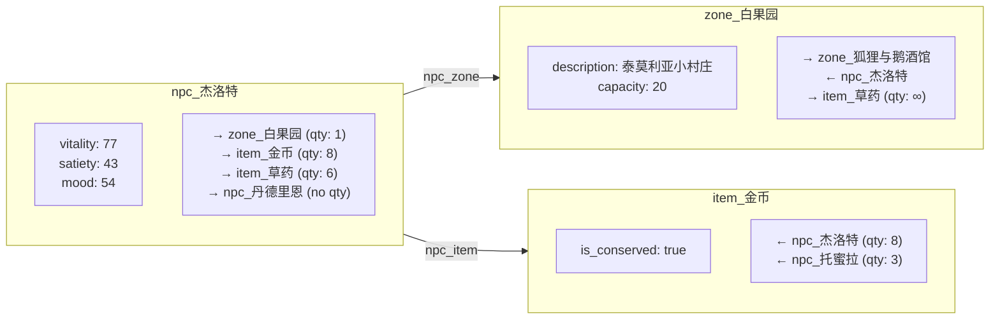
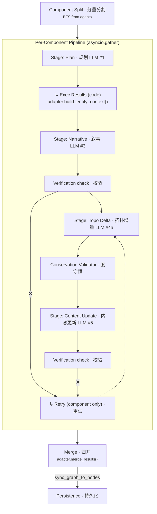
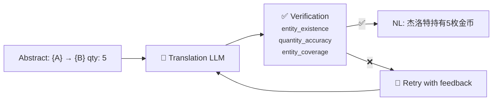
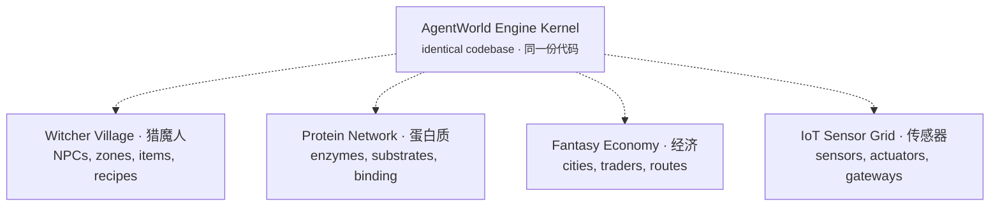

# AgentWorld

<p align="center">
  
  <br/>
  
  <br/>
  
  <br/>
  <em><b>Graph is not a feature. Graph is the system. / 图拓扑不是组件，是整个系统的骨架。</b></em>
  <br/>
  <small>✨ <b>Domain-Agnostic · 域无关</b> — one engine kernel, any world · 同一内核，任意世界 ✨</small>
</p>

---

**AgentWorld** is a graph-first, LLM-driven multi-agent simulation engine. It uses a weighted multi-digraph as its single source of truth, then runs a parallel pipeline of LLM calls — planning → narrative → topology change → attribute projection — to produce emergent agent behavior.

**AgentWorld** 是一个图优先、LLM 驱动的多智能体仿真引擎。它使用加权有向多重图作为唯一真相源，通过并行管线执行 LLM 调用——规划→叙事→拓扑变更→属性投影——产生涌现式智能体行为。

The engine kernel is **domain-agnostic**: swap the config files + adapter, and the same code runs a Witcher village, a protein interaction network, a fantasy economy, or an IoT sensor grid — **zero code changes**.

引擎内核是**域无关**的：换一套配置文件 + 适配器，同一份代码就能跑猎魔人村庄、蛋白质交互网络、幻想经济或物联网传感器网格——**无需改代码**。

---

## Table of Contents · 目录

1. [Why AgentWorld · 为什么](#1-why-agentworld--为什么)
2. [Architecture Overview · 架构总览](#2-architecture-overview--架构总览)
3. [Configuration Layer · 配置层](#3-configuration-layer--配置层)
4. [Persistence Layer · 持久层](#4-persistence-layer--持久层)
5. [Graph Engine · 图引擎](#5-graph-engine--图引擎)
6. [Pipeline · 管线](#6-pipeline--管线)
7. [Verification & Feedback · 校验与反馈](#7-verification--feedback--校验与反馈)
8. [Domain Purification · 域净化](#8-domain-purification--域净化)
9. [Cross-Domain Portability · 跨域可移植性](#9-cross-domain-portability--跨域可移植性)
10. [Quick Start · 快速开始](#10-quick-start--快速开始)
11. [Project Structure · 项目结构](#11-project-structure--项目结构)

---

## 1. Why AgentWorld · 为什么

### 1.1 The Problem · 问题

Building a multi-agent simulation traditionally means hardcoding domain logic into every layer: the engine knows about "NPCs", "zones", "inventory", "mood". To simulate a different world — say, protein interactions instead of fantasy characters — you must rewrite the engine.

传统的多智能体仿真中，域逻辑嵌入到每一层：引擎知道 "NPC"、"区域"、"背包"、"心情"。要模拟不同的世界——比如换成蛋白质交互网络——就得重写引擎。

### 1.2 The Solution · 方案

**Decouple the engine kernel from domain knowledge.** Three design choices make this possible:

**将引擎内核与域知识解耦。** 三个设计选择使之成为可能：

1. **Graph as single source of truth** — Every entity is a node, every relationship is an edge. Adjacency queries are O(1), inventory is inherently consistent. No relational JOINs or cached state.

   **图拓扑为唯一真相源**——每个实体是一个节点，每个关系是一条边。邻接查询 O(1)，背包天然一致，无需关系型 JOIN 或缓存状态。

2. **Component-first pipeline** — BFS from agents → connected subgraphs. Each component runs its own LLM pipeline in parallel via `asyncio.gather`. No wasted prompt space on disconnected entities.

   **分量前置管线**——从智能体出发 BFS → 连通分量。每个分量独立并行执行 LLM 管线，不放无关实体进 prompt 浪费 token。

3. **Domain purification** — A `DomainAdapter` interface absorbs all domain-specific logic. The pipeline orchestrator never reads entity types, attribute names, or zone definitions. It only passes opaque dicts between stages.

   **域净化**——`DomainAdapter` 接口吸收所有域特定逻辑。管线编排器从不读实体类型、属性名或区域定义，只在阶段间传递不透明字典。

### 1.3 Key Concepts · 核心概念

| Concept · 概念 | Meaning · 含义 |
|:---------------|:---------------|
| **Entity · 实体** | A node in the graph (NPC, zone, item, object). Each has a `type_id`, attributes, and edges. |
| **Component · 分量** | A connected subgraph found by BFS from agent nodes. Each tick's pipeline runs per component. |
| **Stage · 阶段** | A single LLM call within the component pipeline (Plan → Narrative → Topo Delta → Content Update). Adapter-defined. |
| **Hook · 钩子** | A fixed point in the pipeline where side-effects or retry logic fires. 6 hooks defined (A–F). |
| **Opaque Context · 不透明上下文** | A dict with `_`-prefixed keys produced by the adapter. Pipeline passes it through without reading. |
| **Topology Label · 拓扑标签** | Config-driven flags (`is_starter`, `is_component_anchor`, `is_leaf`) that replace `has_role()` type checks. |
| **Conservation · 守恒** | Items marked `is_conserved: true` must follow Σ=0 for internal flows. Like thermodynamics. |

---

## 2. Architecture Overview · 架构总览

AgentWorld has three layers: **config** (domain-specific) → **engine kernel** (domain-agnostic) → **persistence** (unified).

AgentWorld 分为三层：**配置层**（域特定）→ **引擎内核**（域无关）→ **持久层**（统一）。

<p align="center">
  
</p>

```
┌──────────────────────────────────────────────────────────────┐
│                    Domain-Specific · 域特定                    │
│  config/node_config.json   config/domain.json                │
│  domain/npc_world/adapter.py   (DomainAdapter subclass)      │
└────────────────────────────────┬─────────────────────────────┘
                                 │ Load & seed via DomainAdapter
                                 ▼
┌──────────────────────────────────────────────────────────────┐
│                    Engine Kernel · 引擎内核                    │
│                                                              │
│  Graph Engine — weighted multi-digraph, BFS component split  │
│                                                              │
│  Pipeline — component-first, adapter-driven 5-stage loop     │
│  │  Plan (LLM #1) → Exec Results (code) → Narrative (LLM #3)│
│  │  → Topo Delta (LLM #4a + verification retry) →           │
│  │    Content Update (LLM #5 + verification retry)           │
│                                                              │
│  Verification — 6-check registry, config-masked per domain   │
│  Conservation — Σ=0 validator for conserved items            │
└────────────────────────────────┬─────────────────────────────┘
                                 │ sync_graph_to_nodes() after each tick
                                 ▼
┌──────────────────────────────────────────────────────────────┐
│                    Persistence · 持久层                        │
│  SQLite — unified nodes table                                │
│  NodeDB — generic CRUD, no type-specific getters             │
└──────────────────────────────────────────────────────────────┘
```

**The pipeline is adapter-driven:** the orchestrator calls `adapter.get_pipeline_stages()`, then dispatches each stage to a handler by key. Adapter declares what stages exist, their order, and how to parse output. The engine has zero hardcoded stage logic.

**管线由适配器驱动：** 编排器调用 `adapter.get_pipeline_stages()`，然后按 key 分派到对应处理器。适配器声明有哪些阶段、顺序和输出解析方式。引擎内核没有硬编码的阶段逻辑。

**The only domain-aware line in the entire codebase:**

**整个代码库中唯一的域感知行：**

```python
# run_1tick.py
adapter = NPCWorldAdapter()     # ← swap here for a different world
engine = GraphNPCEngine(adapter=adapter)
orch = PipelineOrchestrator(adapter, engine._resolver, engine.graph_engine)
```

---

## 3. Configuration Layer · 配置层

Two JSON files define every aspect of a world. The engine reads these at startup to seed the database and build the runtime graph.

两个 JSON 文件定义了一个世界的全部。引擎启动时读取它们来填充数据库和构建运行时图。

### 3.1 `node_config.json` — Node Ontology · 节点本体

Defines node **types** (taxonomy, prefix, max_nodes, terminal flags) and all **entity instances** (NPCs, zones, items, objects).

定义节点**类型**（分类、前缀、上限、终端标记）和所有**实体实例**（NPC、区域、物品、物件）。

```
node_config.json
├── node_types[]           # 4 types: npc, zone, item, object
│   ├── id / prefix        # "npc" → "npc_" prefix
│   ├── max_nodes          # Per-type capacity limit
│   ├── roles[]            # "actor", "region", "container", "fixture"
│   ├── switches{}         # terminal, same_type_block, has_recent_info
│   └── prompt{}           # LLM prompt sorting hints
├── entities{}
│   ├── zones[]            # 7 predefined zones
│   ├── items[]            # 11 items
│   ├── npcs[]             # 13 NPCs with full stats
│   └── objects[]          # Fixtures/furniture
├── world{}                # default_time, zone_connections
├── verification{}         # 6-check registry + mask
└── label_mappings{}       # Entity name → topology letter (A–Z)
```

### 3.2 `domain.json` — Semantic Layer · 语义层

Contains every piece of **natural language** and **behavioral rule** that makes the world feel real. Engine never reads this directly — it's injected through the `DomainAdapter`.

包含**所有自然语言和行为规则**，让世界栩栩如生。引擎从不直接读取——通过 `DomainAdapter` 注入。

```
domain.json
├── adapter.system_role{}    # System prompts per LLM stage
├── adapter.output_format{}  # JSON schemas for structured output
├── adapter.*                # Prompt slot templates
│   ├── survival_needs       # "⚠️ vitality < 30: extreme fatigue"
│   ├── entity_identity      # "## NPC: {name} ({role})"
│   ├── inventory            # "### Current items\n{items}"
│   └── decision_guidance    # Behavioral rules in NL
├── zones[]                  # Zone metadata
├── recipes[]                # Transform recipes
└── verification{}           # Masks per layer
```

> 💡 Replacing these two `.json` files + writing a `DomainAdapter` subclass = a new world. The engine kernel never changes.
>
> 💡 换这两个 `.json` 文件 + 写一个 `DomainAdapter` 子类 = 新世界。引擎内核不改。

### 3.3 Seed Flow · 种子数据流

| Source | Target (nodes table) | Rows |
|--------|---------------------|:----:|
| NPC entity definitions | `type="npc"` | 13 |
| Zone definitions | `type="zone"` | 7 |
| Item definitions | `type="item"` | 11 |
| Recipes (from domain.json) | `type="recipe"` | 6 |
| System node (world_time) | `type="system"` | 1 |
| Object definitions | `type="object"` | 1 |
| **Total** | | **38** |

---

## 4. Persistence Layer · 持久层

### 4.1 Unified `nodes` Table · 统一节点表

**All entities live in a single table.** No separate `world`, `npcs`, or `world_objects` tables remain.

**所有实体在同一张表中。** 没有独立的 `world`、`npcs` 或 `world_objects` 表。

```sql
CREATE TABLE nodes (
    id TEXT PRIMARY KEY,        -- "npc_杰洛特" / "zone_白果园" / "item_金币"
    type TEXT NOT NULL,         -- "npc" / "zone" / "item" / "recipe" / "object"
    name TEXT NOT NULL,         -- "杰洛特" / "白果园"
    data TEXT NOT NULL,         -- JSON: attributes, inventory, relationships
    created_at TEXT NOT NULL,
    updated_at TEXT NOT NULL
);
```

### 4.2 NodeDB — Generic CRUD

`NodeDB` in `db/db.py` is the **sole persistence interface**. Zero type-specific getters — all accesses go through `get_nodes(type_filter=...)`.

`NodeDB`（位于 `db/db.py`）是**唯一的持久化接口**。没有类型特定的 getter——所有访问通过 `get_nodes(type_filter=...)`。

| Method | Purpose |
|--------|---------|
| `load_or_seed()` | Load from DB or seed from config on first run |
| `get_nodes(type_filter)` | Generic query — filter by type string |
| `get_node(id)` | Single node lookup |
| `upsert_node(id, type, name, data)` | Create or replace |
| `upsert_many(nodes)` | Batch upsert |
| `delete_node(id)` | Remove |
| `get/save_world_time()` | World clock (system node) |
| `count(type_filter)` | Stats |

### 4.3 Conversion Layer · 转换层

`db/converters.py` keeps `NodeDB` generic:

- `node_to_npc(node_dict)` → `NPC` model (for ad-hoc queries)
- `npc_to_node_dict(npc)` → `dict` (for `nodes.data`)

### 4.4 Lifecycle · 生命周期

```
Startup:   load_or_seed()  ──→  GraphEngine (runtime)
Each tick: GraphEngine → sync_graph_to_nodes()  ──→  DB
On create: LLM #4a → _on_graph_entity_created()  ──→  upsert to DB
```

---

## 5. Graph Engine · 图引擎

The core data structure — a **weighted multi-digraph**. Every entity is a node, every relationship is an edge with a quantity.

核心数据结构——**加权有向多重图**。每个实体是一个节点，每个关系是一条带数量的边。

### 5.1 Data Model · 数据模型



### 5.2 Edge Types · 边类型

| Edge Type | Semantics | qty meaning |
|-----------|-----------|-------------|
| `npc_zone` | NPC is in a zone | 1 (single zone) |
| `zone_zone` | Zone connectivity | 1 |
| `npc_item` | NPC holds item | held count |
| `zone_item` | Zone has item in stock | stock count |
| `npc_npc` | Interaction (tick-level) | interaction strength |
| `zone_npc` | NPCs in zone (auto-maintained) | 1 |
| `npc_object` | NPC using object | 1 |

### 5.3 Key Operations · 关键操作

| Operation | What it does |
|-----------|-------------|
| `supply_view(entity_id)` | Recursive inventory aggregation → `{item: total_qty}` |
| `build_components()` | BFS from starter entities → connected subgraphs (for parallel pipeline) |
| `apply_edge_operations(ops)` | Commit delta/system_delta/recipe ops atomically |
| `entity_to_node_dict()` | Serialize runtime entity for DB sync |

---

## 6. Pipeline · 管线

### 6.1 Why Component-First? · 为什么分量前置？

**Before** (deprecated): Global LLM #1 for ALL NPCs → intent parsing → component split → per-component stories. Wasted prompt context on disconnected entities, couldn't parallelize.

**以前**（已弃用）：对所有 NPC 执行全局 LLM #1 → 意图解析 → 分量分割 → 逐分量故事。在无关实体上浪费 prompt 上下文，无法并行。

**After** (current): BFS component split first → each component runs the full 5-stage pipeline independently via `asyncio.gather`.

**现在**（当前）：先 BFS 分量分割 → 每个分量独立通过 `asyncio.gather` 并行执行完整的 5 阶段管线。

### 6.2 Stage Flow · 阶段流程



### 6.3 Stage Details · 阶段详情

| Stage | Type | Input → Output | Retry |
|:------|:-----|:---------------|:------|
| **Component Split** | Code | GraphEngine topology → N components (BFS) | — |
| **#1 Plan** | LLM | Entity state + topology → NL plan | — |
| **↳ Exec Results** | Code | GraphEngine → opaque exec dict per NPC (via `adapter.build_entity_context()`) | — |
| **#2 Structure** | LLM | Topology → abstract structure description | — |
| **#3 Narrative** | LLM | Plans + exec_results → story text | — |
| **#4a Topo Delta** | LLM | Plans + stories + topology → structured delta/system_delta/recipe ops | ✅ feedback retry |
| **↳ Conservation Validator** | Code | Topo ops → Pass/Fail | Triggers retry |
| **#5 Content Update** | LLM | Results + stories + topo diff → attr deltas + recent_info | ✅ feedback retry |
| **↳ Verification** | Code | All outputs → Pass/Fail (6 checks) | Triggers retry |
| **↳ Merge** | Code | N component results → aggregated operations | — |

### 6.4 Prompt Assembly · Prompt 组装

Each prompt is assembled from ordered **slots**. Each slot has a provider:

每个 prompt 由有序的**插槽**组装而成。每个插槽有一个提供者：

```
LLM #1 prompt = [
  ("time_info",         "runtime"),     # ← system clock
  ("survival_needs",    "content"),     # ← domain.json via adapter.render_slot()
  ("entity_identity",   "content"),     # ← domain.json
  ("label_mapping",     "topology"),    # ← graph engine (topology labels)
  ("topology_graph",    "topology"),    # ← graph engine (+ Translation Layer)
  ("decision_guidance", "content"),     # ← domain.json
]
```

**Three providers:**
- **`"content"`** — Text from `domain.json` via `DomainAdapter.render_slot()`
- **`"topology"`** — Engine-rendered data (labels, edges), optionally through Translation Layer
- **`"runtime"`** — Live data (clock, feedback)

### 6.5 LLM Output Schemas · 输出格式

**LLM #4a (Topo Delta):**

```json
{
  "thinking": "The tavern needs restocking...",
  "operations": [
    {"op": "delta", "src": "{npc_geralt}", "tgt": "{item_coin}", "delta": -2},
    {"op": "system_delta", "tgt": "{npc_geralt}", "item": "{zone_狐狸与鹅酒馆}", "delta": 1},
    {"op": "recipe", "src": "{npc_hatori}", "consumes": {"{item_ore}": 3}, "produces": {"{item_weapon}": 1}}
  ]
}
```

**LLM #5 (Content Update):**

```json
{
  "operations": [
    {"op": "attr", "target": "杰洛特", "attr": "vitality", "delta": -8, "description": "在市场寻找炼金材料"},
    {"op": "attr", "target": "丹德里恩", "attr": "mood", "delta": 5, "description": "在酒馆唱歌赢得喝彩"}
  ],
  "recent_info": {
    "杰洛特": "我在白果园广场转了一圈，打算去炼金小屋找特莉丝",
    "丹德里恩": "在酒馆唱了一首叙事诗，听众赏了几个铜板"
  }
}
```

### 6.6 Translation Layer · 翻译层

The engine uses **abstract letter labels** (A, B, C...) instead of entity names in topology prompts, to prevent LLM entity hallucination. A dedicated translation step converts these to natural language before feeding to downstream stages.

引擎在拓扑 prompt 中使用**抽象字母标签**（A, B, C...）替代实体名，防止 LLM 实体幻觉。专门的翻译步骤在喂给下游阶段前将标签转为自然语言。



---

## 7. Verification & Feedback · 校验与反馈

### 7.1 Two-Layer Verification · 两层校验

1. **Post-LLM #4a (Topo Delta)**: 6 checks run against proposed topology operations
2. **Post-LLM #5 (Content Update)**: Attribute projections and recent_info validated

Each check is enabled/disabled by a **mask** in `domain.json` — configurable per domain.

每个校验由 `domain.json` 中的**掩码**控制开启/关闭——可每域配置。

### 7.2 6-Check Registry · 六项校验

| Index | Check | Layer | Description |
|:-----:|:------|:------|:------------|
| 0 | **entity_existence** | Translation + Pre-write | All referenced entities exist in graph |
| 1 | **quantity_accuracy** | Translation | NL quantities match ground truth |
| 2 | **capacity_upper_bound** | Pre-write | Negative deltas ≤ current edge qty |
| 3 | **entity_coverage** | Translation | Every entity appears in NL description |
| 4 | **direction_pairing** | LLM | Bidirectional flows alternate correctly |
| 5 | **story_consistency** | LLM | Topo ops align with story narrative |

### 7.3 Adaptive Retry (Hook C) · 自适应重试

A 3-tier degressive strategy for LLM API timeouts:

| Attempt | Timeout | Max Tokens | Temperature |
|:-------:|:-------:|:----------:|:-----------:|
| 1st | 180s | 8192 | 1.0 |
| 2nd | 120s | 3072 | 0.7 |
| 3rd | 120s | 2048 | 0.8 |

`reset_client()` is called between retries. This reduced tick time by up to **42%**.

### 7.4 Conservation (Σ=0) · 度守恒

Inspired by thermodynamics. **Internal** flows must conserve. **System-boundary** flows (consumption, gathering) may not.

灵感来自热力学。**内部**流动必须守恒（Σ=0）。**系统边界**流动（消耗、采集）可以不守恒。

```
┌──────────────────────┐
│  Internal (Σ=0)      │
│   Entity A ↔ Entity B│  ← trades conserved
│   Recipe transforms  │  ← balanced
└────────┬─────────────┘
         │
System boundary ──────────→ Σ ≠ 0
         │
┌────────┴─────────────┐
│  Environment (Σ≠0)   │
│   Consumption · 消耗  │
│   Gathering · 采集    │
│   Entropy decay · 衰减│
└──────────────────────┘
```

Only items marked `is_conserved: true` participate in conservation checks.

### 7.5 Entity Existence Toggle · 实体存在开关

`node_config.json` → `world.allow_unregistered_entity`:

| Setting | Effect |
|:--------|:-------|
| **`false`** | Every src/tgt must match existing graph node |
| **`true`** | Auto-create missing nodes (enables recipe products, emergent items) |

### 7.6 Hook Summary · 钩子总览

| Hook | Location | Purpose |
|:-----|:---------|:--------|
| **A** | component split → pipeline | BFS → per-component routing |
| **B** | post-plan → exec_results | `adapter.build_entity_context()` for downstream stages |
| **C** | `_call_minimax()` | Adaptive timeout: 180s→120s→120s |
| **D** | post-LLM parse | `parse_llm_output()` → retry on JSON parse failure |
| **E** | post-LLM #4a/#5 | 6 checks → `build_feedback()` → retry |
| **F** | Σ=0 violation | Demote ops to non-conserved grade |

---

## 8. Domain Purification · 域净化

### 8.1 Principle · 原则

The engine kernel has been **domain-purified**: no `has_role()` calls, no hardcoded field names, no domain-specific constants in any service file.

引擎内核经过**域净化**：没有 `has_role()` 调用，没有硬编码的字段名，没有任何服务文件中的域特定常量。

```
Before (contaminated):
  pipeline_orchestrator._exec_result_dict()  # knows npc_name/zone_after/mood_text
  pipeline_orchestrator._find_zone()          # knows type_id=="region"
  pipeline_orchestrator._val_text()           # knows mood/vitality/satiety
  post_processor, conservation_validator, interaction_layer:
    has_role(e.type_id, "region"/"thing"/"actor")

After (purified):
  All domain logic → DomainAdapter
  Pipeline passes opaque dicts between stages, never reads internals
  has_role() → entity topology labels (is_starter, is_component_anchor, is_leaf)
  Verification checks → config-driven masks
```

### 8.2 Dependency Injection · 依赖注入

`GraphNPCEngine.__init__(adapter=adapter)` — the adapter is injected at the single entry point (`run_1tick.py`).

```python
# run_1tick.py — the ONLY domain-aware line in the codebase
adapter = NPCWorldAdapter()
engine = GraphNPCEngine(adapter=adapter)
orch = PipelineOrchestrator(adapter, engine._resolver, engine.graph_engine)
```

### 8.3 Adapter Interface (24 Methods) · 适配器接口

| Method | Purpose |
|:-------|:--------|
| `domain_name()` | Domain label for logging/verification |
| `classify_node()` | `NodeClassification` — is_actor, is_container, is_consumable, is_location |
| `describe_node()` | `NodeDescriptor` for prompt rendering |
| `get_pipeline_stages()` | Declare pipeline stages + order |
| `build_entity_context()` | Opaque dict for pipeline (post-plan) |
| `extract_location()` | Find entity's location from edges |
| `resolve_entity_id()` | Generate canonical entity ID from name |
| `format_attribute()` | Render attr key/value for prompt |
| `parse_llm_output()` | Parse LLM response per stage |
| `normalize_name()` | Strip prefix from entity name |
| `extract_op_references()` | Extract entity ID refs from topo ops |
| `get_entity_tags()` | Conservation/conceptual flags |
| `get_names_by_classification()` | List entity names by role |
| `merge_results()` | Merge per-component results |
| `get_node_role()` | Bridge: `NodeRole` enum |
| `get_node_descriptor()` | Bridge: `NodeDescriptor` |
| `get_config()` | Read arbitrary adapter config |
| `get_prompt_template()` | Slot list for a stage |
| `render_slot()` | Render a named prompt slot |
| `get_validators()` | Register graph validators |
| `get_zones()` | Zone definitions |
| `get_recipes()` | Recipe definitions |
| `get_npc_initial_zones()` | Default NPC placements |
| `get_all_entity_names()` | All names for LM prompt safety |

---

## 9. Cross-Domain Portability · 跨域可移植性

### 9.1 One Engine, Multiple Worlds · 同一引擎，无限世界



### 9.2 What Changes · 什么需要改

| Layer | Change needed |
|:------|:-------------|
| **Graph Engine** | ❌ None — same topology kernel |
| **Pipeline Orchestrator** | ❌ None — generic stage loop |
| **Verification System** | ❌ None — driven by config mask |
| **Conservation Rules** | ❌ None — Σ=0 by topology labels |
| **Translation Layer** | ❌ None — abstract → NL pattern unchanged |
| **Prompt Assembly** | ❌ None — slot structure unchanged |
| **DomainAdapter** | 🔄 **New subclass — 24 abstract methods** |
| **`domain.json`** | 🔄 Replace entirely |
| **`node_config.json`** | 🔄 Replace entirely |

**A new domain needs: `DomainAdapter` subclass + `domain.json` + `node_config.json`**. The engine kernel never changes.

**一个新域只需要：** `DomainAdapter` 子类 + `domain.json` + `node_config.json`。引擎内核不需改动。

---

## 10. Quick Start · 快速开始

```bash
pip install -r requirements.txt

# Run a single tick (auto-seeds DB on first run — 38 nodes)
python3 run_1tick.py tick_001

# Reset DB and run
rm data/agent_world.db && python3 run_1tick.py tick_001

# Batch run 50 ticks
python3 run_50ticks.py
```

Output is written to `/tmp/full_tick/<label>/`:

```
/tmp/full_tick/tick_001/
├── LLM1_plans_*.txt       # Plan prompts + responses
├── LLM3_story_*.txt       # Story prompts + responses
├── LLM4a_topo_delta_*.txt # Topo delta prompts + responses
├── LLM5_projection_*.txt  # Content update prompts + responses
├── snapshot_before.json   # Graph state before tick
├── snapshot_after.json    # Graph state after tick
├── timing.json            # Stage-level timing breakdown
└── REPORT.md              # Summary report
```

> ⚠️ **Requires an LLM API key** (MiniMax M2.7 by default, configurable in `interaction_resolver.py`). One tick runs ~24 LLM calls in ~360s.
>
> ⚠️ **需要 LLM API 密钥**（默认 MiniMax M2.7，可在 `interaction_resolver.py` 中配置）。每 tick 约 24 次 LLM 调用，~360 秒。

---

## 11. Project Structure · 项目结构

```
agentworld/
├── run_1tick.py                   # Single-tick runner (DI entry point)
├── run_50ticks.py                 # Batch runner (50 ticks)
├── requirements.txt
│
├── src/agent_world/
│   ├── config/                    # World configuration (swap = new world)
│   │   ├── config_loader.py       #   JSON → index queries
│   │   ├── domain.json            #   ALL semantic content (prompts, recipes, masks)
│   │   └── node_config.json       #   Node ontology + entity definitions
│   │
│   ├── db/                        # Persistence: unified nodes table
│   │   ├── db.py                  #   NodeDB — generic CRUD
│   │   └── converters.py          #   Node ↔ model converters
│   │
│   ├── domain/                    # Domain adapter (DI injectable)
│   │   ├── adapter.py             #   24-method abstract base class
│   │   └── npc_world/
│   │       └── adapter.py         #   NPCWorldAdapter (Witcher domain)
│   │
│   ├── entities/                  # Entity model
│   │   └── base_entity.py         #   Graph node class
│   │
│   ├── models/                    # Pydantic data models
│   │   ├── interaction.py         #   Interaction models
│   │   ├── npc.py                 #   NPC, NPCStatus, Position
│   │   ├── npc_defaults.py        #   create_diverse_npcs()
│   │   └── world.py               #   World, Zone, WorldTime
│   │
│   └── services/                  # Engine kernel (domain-agnostic)
│       ├── graph_engine.py        #   🔷 Weighted multi-digraph, BFS
│       ├── graph_adapter.py       #   DB/Config → Graph + sync
│       ├── graph_npc_engine.py    #   Tick entry (DI receives adapter)
│       ├── pipeline_orchestrator.py # 🔷 Adapter-driven stage loop
│       ├── pipeline_engine.py     #   LLM call wrappers + timing
│       ├── prompt_assembler.py    #   Slot-based prompt assembly
│       ├── interaction_resolver.py # LLM API (MiniMax + adaptive retry)
│       ├── interaction_layer.py   #   LLM #3: story generation
│       ├── post_processor.py      #   LLM #4a +#5 parsers
│       ├── verification_layer.py  #   Verification orchestrator
│       ├── verification_registry.py # 6-check registry
│       └── conservation_validator.py # Σ=0 validator
│
├── docs/internal/                 # Internal documentation
│   ├── AGENT_WORLD.md             #   Full technical reference
│   ├── KNOWN_ISSUES.md            #   Active issues log
│   └── WITCHER_WORLD.md           #   Default domain description
│
└── data/                          # SQLite database (generated, gitignored)
    └── agent_world.db
```

---

## Technical Stack · 技术栈

**Python 3.12+** · **Pydantic v2** · **MiniMax M2.7 API** (default) · **OpenAI** (fallback) · **SQLite** · **Custom weighted multi-digraph**

---

## License · 许可

MIT
