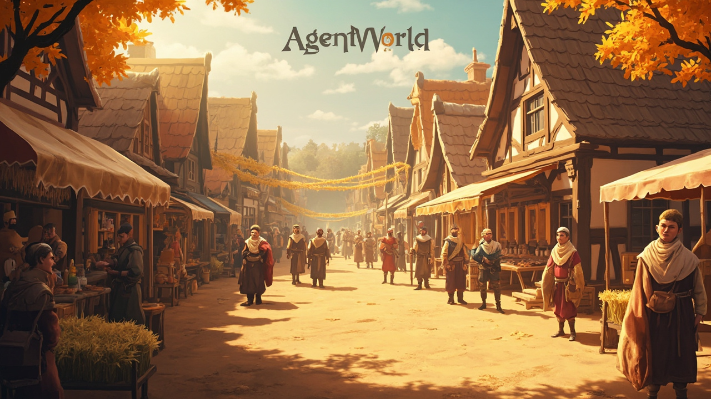
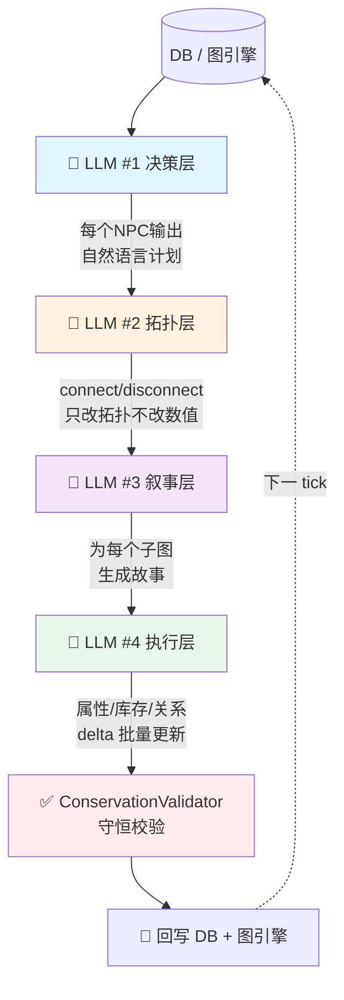
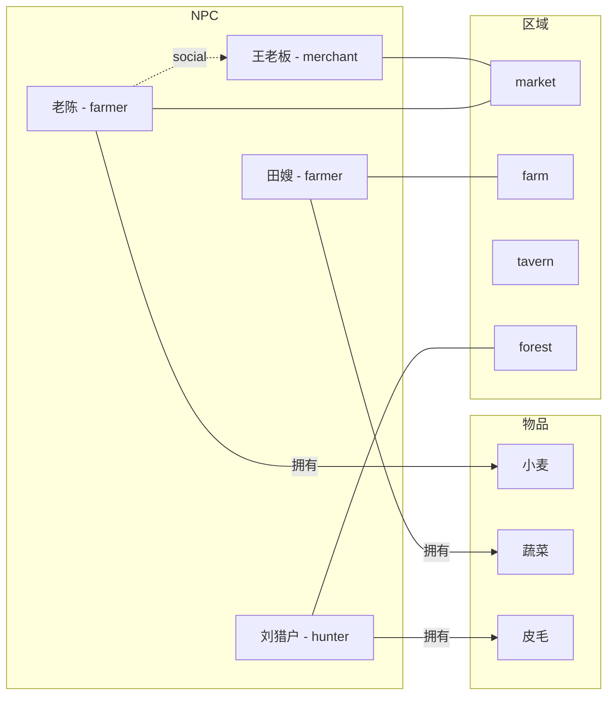
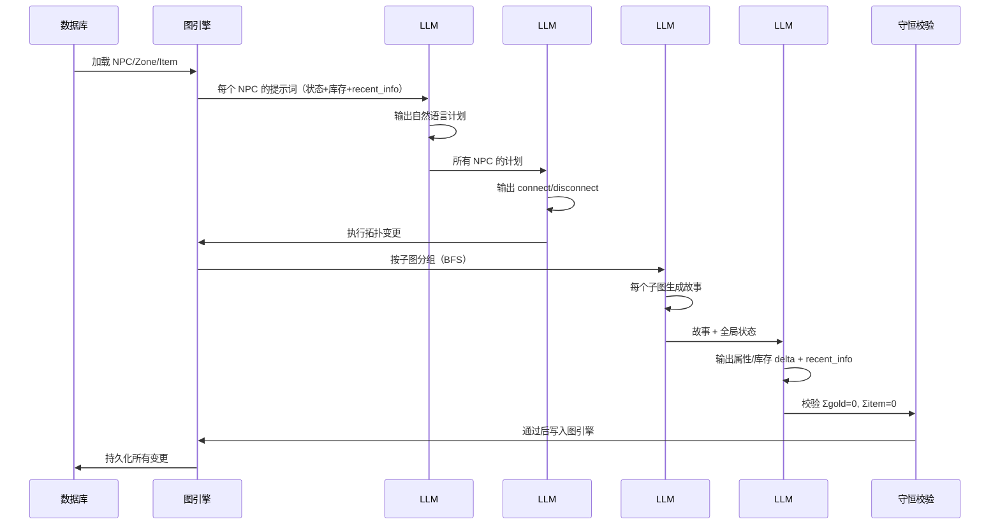

# AgentWorld

<p align="center">
  
</p>

> 基于 LLM 驱动的多 NPC 世界模拟引擎

一个由 **4 层 LLM 管线**驱动的多智能体世界模拟系统。NPC 在村庄、森林、集市、酒馆等区域中自主生活、交易、社交，所有行为由大模型实时决策，代码仅负责拓扑约束和守恒验证。

## 核心架构

### 4 层 LLM 管线（每 Tick）



### NPC 世界拓扑



### 设计原则

- **LLM 是大脑，代码是骨架**：代码提供上下文和约束，LLM 做判断
- **自然语言 > 硬编码阈值**：不写 `if vitality < 30: rest()`，而是注入 prompt 让 LLM 自行判断
- **纯拓扑边**：NPC 之间只有数量连接（连通/断连），不携带接口语义
- **守恒校验**：所有交易必须通过 ConservationValidator（物资/金币守恒）

## 项目结构

```
src/agent_world/
├── api/              # HTTP API 层
├── cognition/        # LLM prompt 构建
│   ├── npc_prompt_builder.py   # LLM #1 决策 prompt
│   └── memory.py              # 记忆管理（已迁移至 recent_info）
├── config/           # 节点本体、世界配置
│   └── node_ontology.py       # 节点类型标签（terminal/same_type_block/has_recent_info）
├── db/               # SQLite 持久化
│   ├── db.py                  # 数据库会话管理
│   └── schemas.py             # ORM 模型
├── entities/         # 实体模型
│   ├── base_entity.py         # Entity 基类（type_id/instance_id 双ID）
│   ├── derivation.py          # 配方推导
│   ├── manager.py             # 实体管理器
│   ├── recipe.py              # 配方注册表
│   └── world_objects.py       # 世界物品定义
├── models/           # Pydantic 数据模型
│   ├── npc.py                 # NPC 模型（vitality/satiety/mood）
│   ├── npc_defaults.py        # 16 个预设 NPC 背景
│   └── world.py               # 世界时间系统（四季/昼夜）
└── services/         # 核心服务层
    ├── graph_npc_engine.py    # 📌 主编排引擎，驱动整个 tick
    ├── graph_engine.py        # 📌 图引擎：实体管理、边拓扑、库存视图
    ├── graph_adapter.py       # DB → 交互图构建
    ├── intent_executor.py     # LLM #2 拓扑执行
    ├── interaction_layer.py   # LLM #3 子图故事生成
    ├── post_processor.py      # LLM #4 批量更新 + 自动对称
    ├── conservation_validator.py  # 守恒校验器
    ├── interaction_resolver.py    # LLM 调用封装
    ├── recipe_engine.py       # 配方处理引擎
    └── world_updater.py       # 世界状态更新

bin/
├── run_tick_report.py    # 单 tick 报告生成器
└── run_20ticks.py        # 20 tick 批量运行器

docs/                     # 架构决策记录 (ADR)
```

## 快速开始

```bash
# 安装依赖
pip install -r requirements.txt

# 初始化数据库
python3 -c "from agent_world.db.db import init_db; init_db()"

# 运行 1 个 tick
python3 bin/run_tick_report.py

# 运行完整报告（含 LLM 调用明细）
python3 bin/run_tick_report.py --npc 老陈 --save

# 批量运行 20 tick
python3 bin/run_20ticks.py
```

## 世界设定

### 时间系统

- 四季轮转：春 → 夏 → 秋 → 冬
- 白天（06:00-21:00）：每 tick 推进 **30 分钟**
- 夜间（21:00-06:00）：每 tick 推进 **6 小时**（NPC 休息期加速）
- 起始时间：春·第 1 天 08:00

```mermaid
gantt
    title 世界时间推进规则
    dateFormat HH:mm
    axisFormat %H:%M

    section 白天段
    清晨-傍晚     :active, d1, 06:00, 15h
    section 夜间段
    夜间加速     :night, n1, 21:00, 9h
```

### 区域一览

| 区域 | 类型 | 说明 |
|------|------|------|
| farm | 农业区 | 农田，作物种植 |
| market | 商业区 | 交易集散中心 |
| tavern | 社交区 | 酒馆，NPC 社交 |
| barracks | 军事区 | 卫兵驻地 |
| library | 知识区 | 书籍与知识 |
| temple | 宗教区 | 祭祀与祈祷 |
| forest | 野外区 | 打猎与采集 |
| village_square | 中心区 | 广场公告 |

### NPC 属性

| 属性 | 范围 | 说明 |
|------|------|------|
| vitality (体力) | 0-100 | 每 tick -5，低于 30 必须休息 |
| satiety (饱腹) | 0-100 | 每 tick -1，低于 20 需要进食 |
| mood (心情) | 0-100 | 每 tick -0.5，社交/交易提升 |

## LLM 管线详解



| 层级 | 输入 | 输出 | 职责 |
|------|------|------|------|
| **#1 决策** | NPC 属性 + 库存 + 位置 + `recent_info` | 自然语言计划 | 决定该 tick 做什么 |
| **#2 拓扑** | 所有 NPC 计划 | `connect/disconnect` 操作 | 空间/社交移动 |
| **#3 叙事** | 拓扑变更后的子图 | 自然语言故事 | 为每个交互场景生成叙事 |
| **#4 执行** | 故事 + 全局状态 | 属性/库存 `delta` + `recent_info` | 执行交易、更新属性、写回记忆 |

## 技术栈

- **Python 3.12+** with Pydantic v2
- **LLM**: MiniMax / Anthropic 兼容 API
- **图引擎**: 自定义内存级图拓扑（非 NetworkX）
- **持久化**: SQLite
- **验证**: ConservationValidator 保证经济系统守恒

## License

MIT
