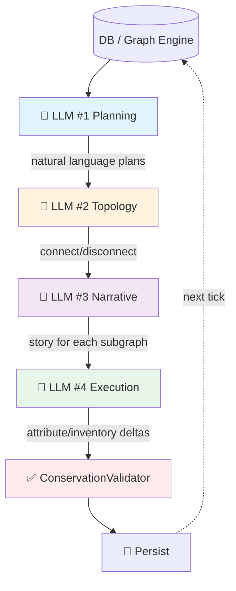
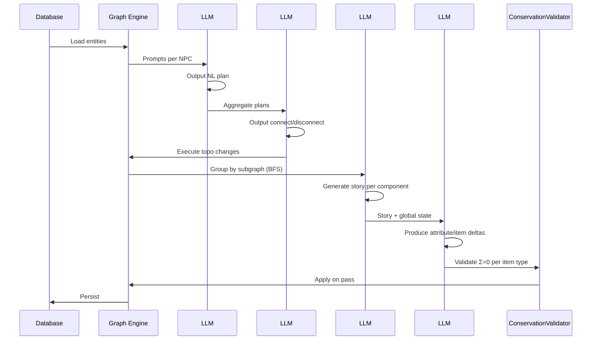

# AgentWorld

<p align="center">
  
</p>

> A domain-agnostic, LLM-driven multi-agent world simulation engine.

AgentWorld is a **4-layer LLM pipeline** that drives NPCs to live, trade, and socialize in a shared world. The engine is purely topological — it doesn't know what a "zone" or "item" means. All semantic knowledge lives in configuration files and LLM prompts.

## Architecture

### 4-Layer LLM Pipeline (per Tick)



| Layer | Input | Output | Role |
|-------|-------|--------|------|
| **#1 Plan** | NPC state + inventory + location | Natural language plan | *What to do* |
| **#2 Topology** | All NPC plans | `connect/disconnect` | *Spatial/social movement* |
| **#3 Story** | Subgraph structure after topo change | Natural language story | *What happened* |
| **#4 Execute** | Story + global state | Attribute/inventory deltas | *Apply changes* |

### Full Tick Cycle



## Design Principles

### LLM is the Brain, Code is the Skeleton

Code provides context and constraints. The LLM makes all decisions.

```
Code: builds prompt, validates output format, executes LLM decisions
LLM:  understands state, makes judgments, creates narrative
Code does not make decisions for the LLM — it only provides information and boundaries.
```

### Natural Language > Hardcoded Thresholds

```python
# ❌ Anti-pattern (removed):
if npc.vitality < 30: go_rest()

# ✅ Current:
# Prompt injects: ⚠️ vitality < 30: extreme fatigue, must rest
# NPC decides: where to rest? how long? what to do after?
```

### Topology–Content Decoupling

The engine must **not** contain code that branches on semantic entity types:

```python
# ❌ Forbidden — engine knows about "NPC":
if entity_type == "zone": ...

# ✅ Allowed — engine consults declarative config by type_id:
if NODE_ONTOLOGY[ent.type_id].get("terminal"): ...
```

The **topology layer** (traversal, grouping, connectivity) knows nothing about the semantic meaning of any node type. It only reads numeric type IDs and a configuration table.

The **content layer** (names, attributes, memories, descriptions) carries all semantic information and is consumed exclusively by LLMs and prompts.

### Why Graph Structure?

Traditional simulations maintain per-NPC fields (`current_zone`, `inventory[]`). This works for point queries but breaks for world-level queries ("who's in this zone? who has this item?").

Graph solves this: **everything is a first-class node, connections are edges.**

| Query | SQL/Traditional | Graph |
|-------|----------------|-------|
| Where is NPC X? | Read `npc.current_zone` | `npc.get_edge("npc_zone").target` |
| Who's in zone Y? | Scan all NPCs | `zone.get_neighbors()` filter NPCs |
| What does NPC X have? | Read `npc.inventory` | Traverse `npc_item` edges with qty |
| Can NPC X craft item Z? | Check recipe permissions | `npc.has_edge("can_craft", Z)` |

### Layered Constraint Spectrum

Different LLM layers have different constraint tightness:

```
LOOSE ────────────────────────────────────────────────── TIGHT
LLM #1 (Plan)       LLM #3 (Story)      LLM #2 (Topo)       LLM #4 (Post)
free text           free narrative       structured JSON     structured JSON
no format           no format            with schema         reads DB, not LLM#1
allows personality  allows invention     moderate            tight
```

Key insight: **LLM #4 does not read LLM #1 output.** It only reads the DB. This means LLM #1 can exaggerate, misremember, or create unrealistic plans — it adds personality. LLM #4 ignores all of it and works from ground truth.

### Conservation Validation (Thermodynamics-Inspired)

The system distinguishes between **internal transactions** (must conserve) and **environmental boundaries** (may not conserve):

```
                    ┌──────────────────────┐
                    │  Internal (Σ=0)      │
                    │   NPC A ↔ NPC B      │  ← trades conserved
                    │   Recipe transforms  │  ← input/output balanced
                    └────────┬─────────────┘
                             │
                    System boundary ────────
                             │
                    ┌────────┴─────────────┐
                    │  Environment (Σ≠0)   │
                    │   Eating (consumes)  │  ← item disappears
                    │   Gathering (creates)│  ← item appears
                    │   Vitality decay     │  ← entropy
                    └──────────────────────┘
```

## Project Structure

```
src/agent_world/
├── api/                  # HTTP API
├── cognition/            # LLM prompt construction
├── config/               # Ontology + world configuration
│   ├── domain.json       # **Domain-specific content** (swap for new world)
│   └── node_config.json  # Node types, entity definitions, world topology
├── db/                   # SQLite persistence
├── entities/             # Entity models
├── models/               # Pydantic data models
└── services/             # Core pipeline
    ├── graph_npc_engine.py       # Main orchestration engine
    ├── graph_engine.py           # Graph topology engine
    ├── graph_adapter.py          # DB → Graph adapter
    ├── intent_executor.py        # LLM #2 execution
    ├── interaction_layer.py      # LLM #3 story generation
    ├── interaction_resolver.py   # LLM call wrapper
    ├── post_processor.py         # LLM #4 batch update
    ├── prompt_assembler.py       # Prompt construction (slot-based)
    ├── domain_adapter.py         # Renders domain slots from domain.json
    ├── conservation_validator.py # Conservation validation
    └── verification_registry.py  # Unified verification framework
```

## Creating Your Own World

AgentWorld is domain-agnostic. To create a new world:

1. **Write `config/domain.json`** — define NPCs, zones, items, recipes, prompt slots
2. **Update `config/node_config.json`** — node types and entity definitions
3. **Run a tick** — the engine reads configuration, no code changes needed

> See [`WITCHER_WORLD.md`](WITCHER_WORLD.md) for the built-in "Witcher" domain example.

## Quick Start

```bash
pip install -r requirements.txt

# Initialize database (creates data/agent_world.db)
python3 -c "from agent_world.db.db import init_db; init_db()"

# Run a single tick with real LLM calls
python3 run_minimal_tick.py
```

## Technical Stack

**Python 3.12+** · **Pydantic v2** · **MiniMax / Anthropic API** · **SQLite** · **Custom Graph Engine**

## License

MIT
