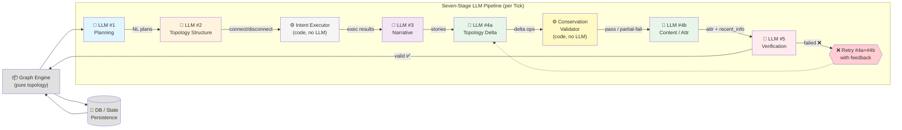
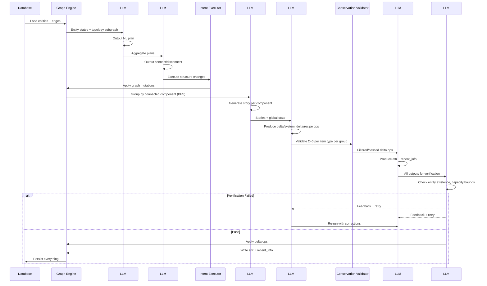

# AgentWorld

<p align="center">
  
</p>

> A domain-agnostic, LLM-driven multi-agent graph simulation engine.
>
> Think of it as a **topology-first world simulator**: entities are graph nodes, relationships are edges, and LLMs reason over the structure to produce emergent behavior.

AgentWorld is built on a single principle: **separate topology from semantics**. The engine manages a pure graph — nodes, edges, quantities, connectivity — while all domain knowledge (what a node *means*, what connections signify) lives in configuration files and LLM prompts.

Swap a config file, and the same engine simulates medieval villages, protein interaction networks, IoT sensor grids, or fantasy economies.

---

## Core Concept: Topology–Content Decoupling

The engine never branches on semantic entity types:

```
# ❌ Forbidden — engine knows about "NPC" or "item":
if entity.type_id == "zone": ...

# ✅ Allowed — engine reads type from config, treats all nodes equally:
if NODE_ONTOLOGY[ent.type_id].get("terminal"): ...
```

| Layer | What It Knows | What It Doesn't Know |
|-------|--------------|---------------------|
| **Topology** (graph engine, traversal, grouping) | Node IDs, edge quantities, connectivity | What any node *means* |
| **Content** (prompts, config, LLMs) | Names, attributes, descriptions, rules | How nodes are connected |

The topological engine sees a uniform graph of typed nodes and labeled edges. Semantic meaning is layered on top by **slot-based prompts** — configurable content blocks injected into LLM context at assembly time.

---

## Pipeline Architecture



### Stage Details

| Stage | Input | Output | Mechanism |
|-------|-------|--------|-----------|
| **#1 Plan** | Entity state + inventory + location + personality | Natural language plan | LLM reads current subgraph, decides what to do |
| **#2 Topology Structure** | All entity plans | `connect` / `disconnect` / `set_qty` | LLM decides spatial or relational movement |
| **↳ Intent Executor** | Topology ops | Executed graph mutations | Pure code — applies structural changes |
| **#3 Narrative** | Updated subgraph + plans | Natural language story | LLM writes story for each connected component |
| **#4a Topology Delta** | Stories + current state | `delta` / `system_delta` / `recipe` ops | LLM decides resource flow between nodes |
| **↳ Conservation Validator** | Delta operations | Pass / partial-fail with group isolation | Code validates Σ=0 per item type per group |
| **#4b Content** | Stories + topology | `attr` deltas + `recent_info` summaries | LLM writes attribute changes and episode summaries |
| **#5 Verification** | All outputs | Pass → persist / Fail → retry #4a+#4b | Translation layer check → pre-write check |
| **↳ Retry Loop** | Verification feedback | Corrected outputs | LLM #4a+#4b re-run with error feedback |

### LLM Pipeline as Sequence



---

## Architecture Pillars

### 1. Graph-First Everything

Traditional simulations use per-entity fields (`entity.current_region`, `entity.inventory[]`). This works for point queries but breaks for world-level queries:

| Query | Traditional | Graph |
|-------|-------------|-------|
| Where is entity X? | Read `X.current_region` | `X.get_edge("region").target` |
| Who's in region Y? | Scan all entities | `Y.get_neighbors()` filter by type |
| What does X hold? | Read `X.inventory` | Traverse `X→Resource` edges with qty |
| Can X produce Z? | Check recipe permissions | `X.has_edge("can_produce", Z)` |

Every entity is a **first-class graph node**. Every relationship is an **edge with quantity**.

### 2. Slot-Based Prompt Assembly

Each LLM prompt is assembled from ordered slots by provider type:

```
prompt = [
  ("time_info",        "runtime"),     # ← clock data
  ("survival_needs",   "content"),     # ← from domain.json
  ("entity_identity",  "content"),     # ← from domain.json
  ("label_mapping",    "topology"),    # ← graph engine
  ("topology_graph",   "topology"),    # ← graph engine
  ("decision_guidance","content"),     # ← from domain.json
]
```

Three slot providers:
- **`"content"`** — Domain-specific text from `domain.json` via `DomainAdapter.render_slot()`
- **`"topology"`** — Engine-rendered graph data (labels, edges, constraints)
- **`"runtime"`** — Live data (clock, tick duration, feedback)

**Swapping worldviews = swapping `domain.json`.** Slot structure rarely changes.

### 3. Translation Layer: Abstract ↔ Natural Language

The engine renders topology as abstract letter labels (`{A} → {B} qty:5`) to prevent label leakage. A dedicated **translation layer** converts these to domain-specific natural language:

```
{A} → {B} qty:5         ──→   "杰洛特持有5枚金币"
{B} ↔ {C}               ──→   "丹德里恩在狐狸与鹅酒馆"
↑ Abstract topology     ↑ Natural language description
```

The translation layer **verifies its own output** via registered checks:
- **Entity existence**: Translated names must exist in the ground truth
- **Quantity accuracy**: Numeric values must match the source graph
- **Entity coverage**: All entities must appear in the description

Failed checks trigger a retry loop with corrective feedback.

### 4. Layered Verification (LLM #5)

Before any operation is persisted, a verification layer runs two check stages:

**Stage 1 — Translation Verification (post-translation):**
- Ensures the translation layer output is factually accurate
- Runs against ground truth from the graph engine

**Stage 2 — Pre-write Verification (before DB commit):**
- **Entity existence**: Every referenced node must exist in the graph
- **Capacity upper bound**: Outbound deltas must not exceed edge quantity
- (Future) Direction pairing, story consistency — LLM-batch checks

Both stages are **mask-driven**: the active checks are configured in `domain.json`:

```json
{
  "verification": {
    "translation_layer_mask": [true, true, false, true, false, false],
    "prewrite_layer_mask": [true, false, true, false, false, false],
    "max_retries": 1
  }
}
```

### 5. Conservation Validation (Thermodynamics-Inspired)

Internal resource flows must conserve quantity (Σ=0), while system-boundary flows may not:

```
                    ┌──────────────────────┐
                    │  Internal (Σ=0)      │
                    │   Entity A ↔ Entity B│  ← trades conserved
                    │   Recipe transforms  │  ← input/output balanced
                    └────────┬─────────────┘
                             │
                    System boundary ────────
                             │
                    ┌────────┴─────────────┐
                    │  Environment (Σ≠0)   │
                    │   Consumption        │  ← resource disappears
                    │   Gathering          │  ← resource appears
                    │   Entropy decay      │  ← attribute drain
                    └──────────────────────┘
```

Operations are grouped — one failing group doesn't block others.

---

## Verification Registry

All checks are registered in a centralized registry and activated by mask:

| Index | Check Name | Layer | Description |
|:-----:|:----------|:------|:------------|
| 0 | `entity_existence` | Translation + Pre-write | All referenced entities exist in the graph |
| 1 | `quantity_accuracy` | Translation | NL quantity descriptions match ground truth |
| 2 | `capacity_upper_bound` | Pre-write | Outbound deltas don't exceed available quantity |
| 3 | `entity_coverage` | Translation | All entities mentioned in NL output |
| 4 | `direction_pairing` | Pre-write (LLM) | Bidirectional flows alternate direction |
| 5 | `story_consistency` | Pre-write (LLM) | Operations align with narrative direction |

---

## Project Structure

```
src/agent_world/
├── api/                    # HTTP API
├── cognition/              # LLM prompt construction (per-entity)
├── config/                 # Domain configuration
│   ├── domain.json         # **ALL domain-specific content** (swap for any world)
│   └── node_config.json    # Node type ontology, entity definitions
├── db/                     # SQLite persistence
├── entities/               # Entity models
├── models/                 # Pydantic data models
└── services/               # Core pipeline
    ├── graph_npc_engine.py         # Main orchestration engine
    ├── graph_engine.py             # Pure graph topology engine
    ├── graph_adapter.py            # DB → Graph adapter
    ├── domain_adapter.py           # Renders domain slots from domain.json
    ├── prompt_assembler.py         # Slot-based prompt assembly
    ├── interaction_resolver.py     # LLM API wrapper
    ├── interaction_layer.py        # LLM #3 story generation
    ├── intent_executor.py          # LLM #2 execution + structural changes
    ├── post_processor.py           # LLM #4 batch update handler
    ├── conservation_validator.py   # Σ=0 conservation validation
    ├── verification_registry.py    # Centralized check registration
    └── verification_layer.py       # LLM #5 verification orchestrator
```

---

## Creating Your Own World

AgentWorld ships with a "Witcher" domain by default. To build your own:

```bash
# 1. Write config/domain.json — entities, regions, recipes, prompt slots
# 2. Update config/node_config.json — node types and entity ontology
# 3. Run — the engine reads configuration, no code changes needed
```

> See [`WITCHER_WORLD.md`](WITCHER_WORLD.md) for the built-in example domain.

### Domain.json Structure

```json
{
  "world_name": "MyDomain",
  "adapter": {
    "survival_needs": "Your entities have {attribute1}, {attribute2}...",
    "entity_identity": "## Entity: {name}\nRole: {role} | Location: {region}",
    "system_role": {
      "llm2": "You are a topology structure module...",
      "llm3": "You are a narrative layer...",
      "llm4a": "You are a topology delta module...",
      "llm4b": "You are a content change module..."
    },
    ...
  },
  "topology_translator": {
    "entity_types": "Node types include: actor, resource, region...",
    "interaction_rules": "Hint: co-located actors can interact..."
  },
  "verification": {
    "translation_layer_mask": [true, true, false, true, false, false],
    "prewrite_layer_mask": [true, false, true, false, false, false],
    "max_retries": 1
  }
}
```

---

## Quick Start

```bash
pip install -r requirements.txt

# Initialize database
python3 -c "from agent_world.db.db import init_db; init_db()"

# Run a single tick with real LLM calls
python3 run_minimal_tick.py
```

---

## Design Principles

### LLM is the Brain, Code is the Skeleton

```
Code: builds prompt, validates format, executes LLM decisions
LLM:  understands state, makes judgments, creates narrative
Code does not make decisions for the LLM — it only provides information and boundaries.
```

### Natural Language > Hardcoded Thresholds

```python
# ❌ Anti-pattern (removed):
if entity.vitality < 30: go_rest()

# ✅ Current:
# Prompt injects: ⚠️ vitality < 30: extreme fatigue, must rest
# LLM decides: where to rest? how long? what to do after?
```

### Layered Constraint Spectrum

Different stages have different constraint tightness:

```
LOOSE ────────────────────────────────────────────────── TIGHT
LLM #1 (Plan)       LLM #3 (Story)      LLM #2 (Topo)       LLM #4 (Post)
free text           free narrative       structured JSON     structured JSON
no format           no format            with schema         reads DB
allows personality  allows invention     moderate            tight
```

Key insight: **LLM #4 doesn't read LLM #1 output.** It reads the DB. LLM #1 can exaggerate — it adds personality. LLM #4 works from ground truth.

---

## Technical Stack

**Python 3.12+** · **Pydantic v2** · **MiniMax / OpenAI API** · **SQLite** · **Custom Graph Engine**

---

## License

MIT
