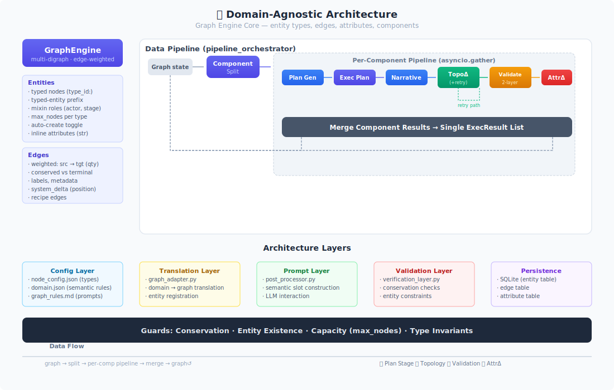
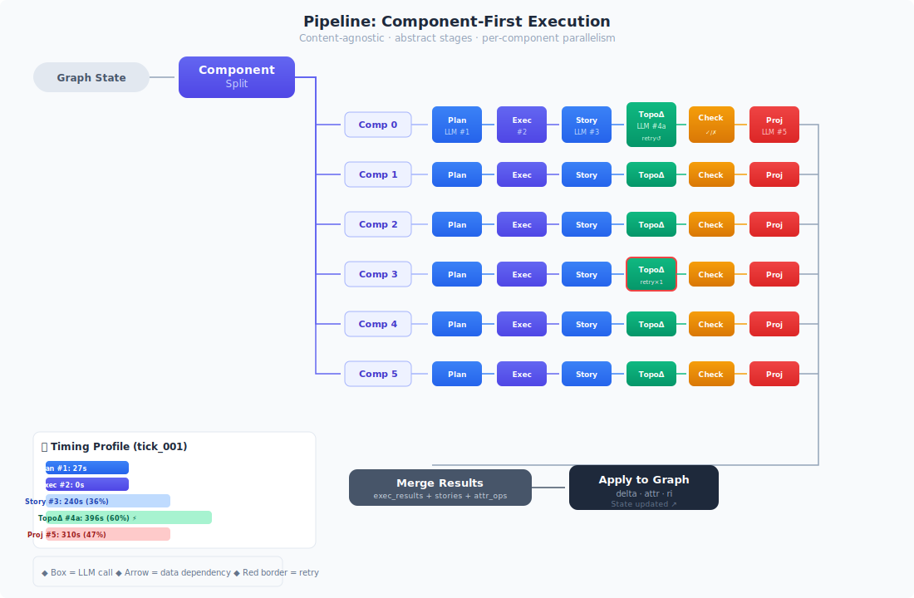
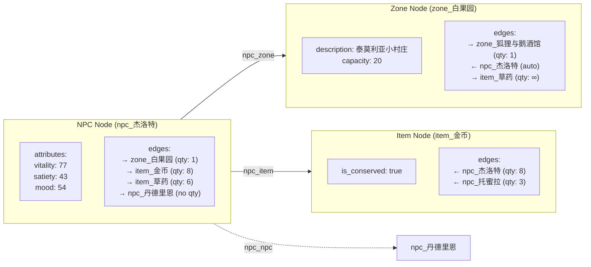
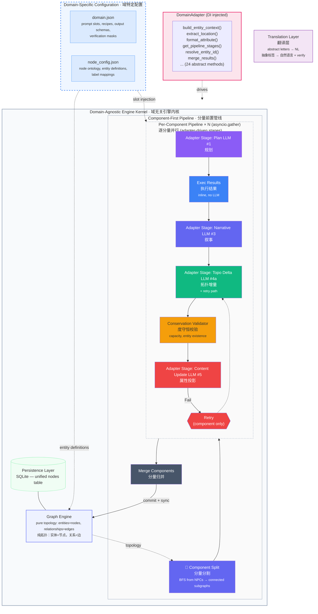
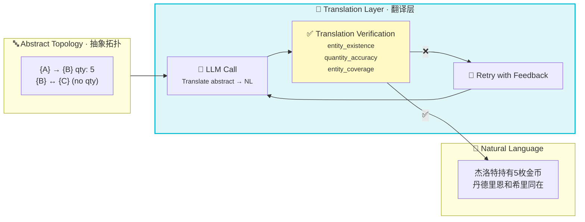
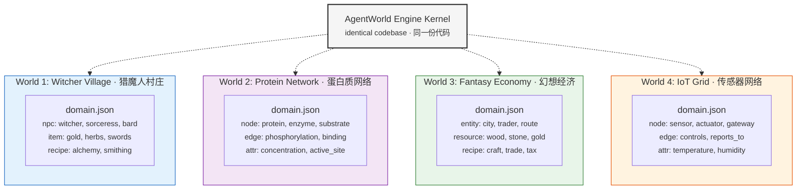

# AgentWorld

<p align="center">
  
  <br/>
  
  <br/>
  
  <br/>
  <em><b>Graph is not a feature. Graph is the system.</b></em>
  <br/>
  <em><b>图拓扑不是组件，是整个系统的骨架。</b></em>
  <br/>
  <small>✨ <b>域无关架构（domain-agnostic）</b> · 拓扑-内容解耦 · 分量前置并行管线 · 统一 `nodes` 表 · 度守恒校验 · DI 注入域适配器 · per-type max_nodes ✨</small>
</p>

---

> **AgentWorld: A Domain-Agnostic, Graph-First, LLM-Driven Multi-Agent Simulation Engine**
>
> **EN**: The graph is the first principle — entities are nodes, relationships are edges, and LLMs reason over the topology to produce emergent behavior. **Domain-agnostic architecture** is the key innovation: the engine kernel operates on abstract, content-free node IDs through a `DomainAdapter` interface. All semantic knowledge lives in `domain.json` and `node_config.json`, accessed exclusively via the adapter. Engine code never reads domain field names directly — it passes opaque dicts between stages. This means swapping the adapter + config files transforms the same engine kernel into a village simulator, a protein interaction network, a fantasy economy, or an IoT sensor grid — **with zero code changes**. The pipeline performs **component split first**, then runs 5 adapter-defined stages per component in parallel via `asyncio.gather`. All entity data persists in a **unified `nodes` table** — no legacy tables remain.
>
> **CN**: 图拓扑是第一性原理——实体是节点，关系是边，LLM 在拓扑之上推理产生涌现行为。**域无关架构**是核心创新：通过 `DomainAdapter` 接口，引擎内核操作抽象的、无内容的节点 ID，所有语义知识通过适配器访问 `domain.json` + `node_config.json`。引擎代码永不直接读取域名段——阶段间传递不透明字典。换适配器 + 配置文件，同一引擎内核可变成村庄模拟器、蛋白质网络、幻想经济或 IoT 传感器网格——**无需改代码**。管线**分量前置**：先做拓扑连通分量分割，再逐分量并行执行 5 个适配器声明的阶段。所有实体数据统一存储在 **`nodes` 表**中。
>
> 💡 **核心创新点**：域无关架构（domain purification）——管线编排器不包含任何域逻辑，全部委托给 `DomainAdapter` 接口。

---

## Table of Contents · 目录

1. [Configuration Layer · 配置层](#1-configuration-layer--配置层)
2. [Persistence Layer · 持久层](#2-persistence-layer--持久层)
3. [Graph Engine · 图引擎](#3-graph-engine--图引擎)
4. [Component-First Pipeline · 分量前置管线](#4-component-first-pipeline--分量前置管线)
5. [Verification & Feedback · 校验与反馈](#5-verification--feedback--校验与反馈)
6. [Domain Purification · 域净化](#6-domain-purification--域净化)
7. [Cross-Domain Portability · 跨域可移植性](#7-cross-domain-portability--跨域可移植性)
8. [Design Principles · 设计原则](#8-design-principles--设计原则)
9. [Project Structure · 项目结构](#9-project-structure--项目结构)
10. [Quick Start · 快速开始](#10-quick-start--快速开始)

---

## 1. Configuration Layer · 配置层

**Two JSON files define every aspect of a world.** The engine reads these at startup to seed the database and build the runtime graph.

### 1.1 `node_config.json` — Node Ontology & Entity Definitions

Defines node **types**, their **taxonomy** (prefix, max_nodes, terminal flags), and all **entity instances** (NPCs, zones, items, objects).

```
node_config.json
├── node_types[]          # Type taxonomy (4 types: npc, zone, item, object)
│   ├── id / prefix       # "npc" → "npc_" prefix
│   ├── max_nodes         # Per-type capacity limit
│   ├── roles[]           # "actor", "region", "container", "fixture"
│   ├── switches{}        # terminal, same_type_block, has_recent_info
│   └── prompt{}          # order, fields[], category (for LLM prompt sorting)
├── entities{}
│   ├── zones[]           # 7 predefined zones (白果园, 诺维格瑞, ...)
│   │   ├── id, name, capacity, description
│   │   └── connects_to[]  # Zone→zone connectivity graph
│   ├── items[]           # 11 items (金币, 草药, 武器, ...)
│   │   ├── id, name, type, description
│   │   └── connected_nodes[]  # Initial entity relationships
│   ├── npcs[]            # 13 NPCs with full stats
│   │   ├── name, role, zone (initial position)
│   │   ├── vitality, satiety, mood
│   │   ├── inventory{}, physical{}, persona{}
│   │   └── primary_goal
│   └── objects[]         # Fixtures/furniture
├── world{}               # default_time, zone_connections topology
├── verification{}        # Check registry + mask (6 checks)
└── label_mappings{}      # Entity name → topology letter (A–Z)
```

### 1.2 `domain.json` — Semantic Layer (Prompt Slots & Rules)

Contains every piece of **natural language** and **behavioral rule** that makes the world feel real. Engine never reads this directly — it's injected into LLM prompts through the `DomainAdapter`.

```
domain.json
├── adapter.system_role{}    # System prompts for each LLM stage
│   ├── llm2, llm3, llm4a, llm5
├── adapter.output_format{}  # JSON schemas for structured outputs
│   ├── llm4a: thinking + operations JSON
│   ├── llm5: attr_ops + recent_info JSON
├── adapter.*                # All prompt slot templates
│   ├── survival_needs       # "⚠️ vitality < 30: extreme fatigue"
│   ├── entity_identity      # "## NPC: {name} ({role})"
│   ├── inventory            # "### 当前持有\n{items}"
│   └── decision_guidance    # Natural language behavior guides
├── zones[]                  # Domain-specific zone metadata
├── recipes[]                # 6 recipes (研磨魔药, 冶炼矿石, ...)
└── verification{}           # Masks per layer (translation, prewrite, topology, projection)
```

> 💡 **Key insight**: Replacing these two `.json` files = creating a new world. The engine kernel never changes.

### 1.3 Config → DB Pipeline

> **Figure: How configuration files feed into the database and engine at runtime.**
> Config is read **once** (first run or DB empty) → seed to `nodes` table. All subsequent runs load from DB, never re-read config.

<p align="center">
  
</p>

**The seed flow (executed by `NodeDB._seed_from_config()`):**

| Source | Target (nodes table) | Rows |
|--------|---------------------|:----:|
| `create_diverse_npcs()` (from config entity defs) | `type="npc"` rows | 13 |
| `get_zones()` + `build_zone_model_full()` | `type="zone"` rows | 7 |
| `get_items()` | `type="item"` rows | 11 |
| `_get_config_recipes()` (from domain.json) | `type="recipe"` rows | 6 |
| hardcoded system node | `type="system"` (world_time) | 1 |
| `objects` (from config entity defs) | `type="object"` rows | 1 |
| **Total seeded** | | **38** |

---

## 2. Persistence Layer · 持久层

### 2.1 Unified `nodes` Table (Phase 2)

**All entities live in a single table.** No separate `world`, `npcs`, or `world_objects` tables remain.

```sql
CREATE TABLE nodes (
    id TEXT PRIMARY KEY,        -- "npc_杰洛特" / "zone_白果园" / "item_金币"
    type TEXT NOT NULL,           -- "npc" / "zone" / "item" / "recipe" / "object"
    name TEXT NOT NULL,           -- "杰洛特" / "白果园"
    data TEXT NOT NULL,           -- JSON: all attributes, inventory, relationships
    created_at TEXT NOT NULL,     -- ISO 8601
    updated_at TEXT NOT NULL      -- ISO 8601
);
```

### 2.2 NodeDB — Generic CRUD

`NodeDB` in `db/db.py` is the **sole persistence interface**. Zero type-specific getters — all accesses go through `get_nodes(type_filter=...)`.

| Method | Purpose |
|--------|---------|
| `load_or_seed()` | Load from DB or seed from config on first run |
| `get_nodes(type_filter)` | Generic query — filter by type string |
| `get_node(id)` | Single node lookup |
| `upsert_node(id, type, name, data)` | Create or replace |
| `upsert_many(nodes)` | Batch upsert |
| `delete_node(id)` | Remove |
| `get/save_world_time()` | System node: world clock |
| `count(type_filter)` | Stats |

### 2.3 Node ↔ Model Converters

Conversion logic lives in `db/converters.py` — keeps `NodeDB` generic:

- `node_to_npc(node_dict)` → `NPC` model object
- `npc_to_node_dict(npc)` → `dict` for `nodes.data`

### 2.4 Persistence Lifecycle

```
Startup:   load_or_seed()  ──→  GraphEngine (runtime)
            (DB → entities)

Each tick: GraphEngine (modified)  ──→  sync_graph_to_nodes()  ──→  DB
                                      (entity_to_node_dict per entity)

On create: LLM#4a creates new zone/entity  ──→  _on_graph_entity_created()  ──→  upsert to DB
```

---

## 3. Graph Engine · 图引擎

> **EN**: The core data structure — a weighted multi-digraph. Every entity is a node, every relationship is an edge with a quantity.
>
> **CN**: 核心数据结构——加权有向多重图。每个实体是一个节点，每个关系是一条带数量的边。

### 3.1 Data Model



### 3.2 Edge Types

| Edge Type | Semantics | qty meaning |
|-----------|-----------|-------------|
| `npc_zone` | NPC in a zone | 1 (single zone) |
| `zone_zone` | Zone connectivity | 1 |
| `npc_item` | NPC holds item | held count |
| `zone_item` | Zone has item | stock count |
| `npc_npc` | Interaction (tick-level) | interaction strength |
| `zone_npc` | NPCs in zone (auto-maintained) | 1 |
| `item_zone` | Item belongs to zone (auto) | stock count |
| `npc_object` | NPC using object | 1 |
| `config_zone` | Seed-time zone links | 1 |

### 3.3 Key Operations

- `supply_view(entity_id)` — recursive inventory aggregation → `{item: total_qty}`
- `build_components()` — BFS from NPCs → connected subgraphs (for parallel pipeline)
- `apply_edge_operations(ops)` — commit delta/system_delta/recipe ops atomically
- `entity_to_node_dict()` → serialize runtime entity state for DB

---

## 4. Component-First Pipeline · 分量前置管线

### 4.1 Architecture Overview

> **Figure: System architecture showing the domain-agnostic kernel. Component split runs first, then per-component adapter-driven pipeline in parallel.**



> 💡 **Pipeline stages are adapter-defined.** The orchestrator iterates `adapter.get_pipeline_stages()`, dispatches each to `_STAGE_HANDLERS` via key match. Adapter declares what stages exist, what order they run, and how to parse their output. Engine code has zero hardcoded stage logic.

### 4.2 Why Component-First?

**Old flow** (deprecated): Global LLM #1 for ALL NPCs → global intent parsing → component split → per-component stories/updates.
- Wasted prompt space on NPCs in different zones
- Large components couldn't be parallelized

**Current flow**: Component split first (BFS on NPC graph) → each component runs full pipeline independently via `asyncio.gather`.

### 4.3 Pipeline Stage Details

| Stage | Type | Input | Output | Retry | Note |
|:------|:-----|:------|:-------|:------|:-----|
| **↳ Component Split** | Code | GraphEngine | N connected components (BFS) | — | Topology-label-driven |
| **#1 Plan** | LLM | Entity state + topology | Natural language plan | — | Adapter-driven prompt |
| **↳ Exec Results** | Code | GraphEngine | Per-NPC opaque exec dict | — | `adapter.build_entity_context()` |
| **#2 Topo Structure** | LLM | Topology graph | Abstract structure | — | No-op (implicit via adjacency) |
| **#3 Narrative** | LLM | Plans + exec_results | Story text | — | Adapter-driven prompt |
| **#4a Topo Delta** | LLM | Plans + stories + topo | `delta`/`system_delta`/`recipe` JSON ops | ✅ feedback retry | Adapter-driven validation |
| **↳ Conservation Validator** | Code | Topo ops | Pass / Fail | Triggers retry | Σ=0 for conserved items |
| **#5 Content Update** | LLM | Results + stories + topo_diff | attr deltas + recent_info | ✅ feedback retry | Adapter-driven prompt |
| **↳ Verification** | Code | All outputs | Pass / Fail | 6-check registry | Masked by config |
| **↳ Merge** | Code | N component results | Aggregated operations | — | `adapter.merge_results()` |

### 4.4 Slot-Based Prompt Assembly

Each LLM prompt is assembled from ordered slots. Each slot has a provider:

```
LLM #1 prompt = [
  ("time_info",         "runtime"),     # ← system clock
  ("survival_needs",    "content"),     # ← domain.json
  ("entity_identity",   "content"),     # ← domain.json
  ("label_mapping",     "topology"),    # ← graph engine
  ("topology_graph",    "topology"),    # ← graph engine (+ Translation Layer)
  ("decision_guidance", "content"),     # ← domain.json
]
```

**Three providers:**
- `"content"` — Text from `domain.json` via `DomainAdapter.render_slot()`
- `"topology"` — Engine-rendered data (labels, edges, constraints), optionally through Translation Layer
- `"runtime"` — Live data (clock, verification feedback)

### 4.5 LLM Output Schemas

**LLM #4a (Topo Delta)** — structured JSON operations:

```json
{
  "thinking": "The tavern needs restocking...",
  "operations": [
    {"op": "delta", "src": "{npc_geralt}", "tgt": "{item_coin}", "delta": -2},
    {"op": "system_delta", "tgt": "{npc_geralt}", "item": "{zone_狐狸与鹅酒馆}", "delta": 1},
    {"op": "recipe", "src": "{npc_hatori}", "consumes": {"{item_ore}": 3}, "produces": {"{item_weapon}": 1}}
  ]
}
```

**LLM #5 (Attribute Projection)** — attr changes + recent_info:

```json
{
  "operations": [
    {"op": "attr", "target": "杰洛特", "attr": "vitality", "delta": -8, "description": "在市场寻找炼金材料"},
    {"op": "attr", "target": "丹德里恩", "attr": "mood", "delta": 5, "description": "在酒馆唱歌赢得喝彩"}
  ],
  "recent_info": {
    "杰洛特": "我在白果园广场转了一圈，打算去炼金小屋找特莉丝",
    "丹德里恩": "在酒馆唱了一首叙事诗，听众赏了几个铜板"
  }
}
```

### 4.6 Translation Layer

The engine uses **abstract letter labels** (A, B, C...) instead of entity names in topology, to prevent LLM entity hallucination. A dedicated Translation Layer converts these to natural language before feeding to LLMs #3 and #4a.



---

## 5. Verification & Feedback · 校验与反馈

### 5.1 Two-Layer Verification

Two verification hooks are built into the pipeline:

1. **Post-LLM #4a (Topo Delta)**: All 6 checks run against the proposed topology operations — entity existence, capacity, direction pairing, etc.
2. **Post-LLM #5 (Content Update)**: Attribute projections and recent_info validated against graph state.

Each check is enabled/disabled by a **mask** in `domain.json` — configurable per domain.

### 5.2 6-Check Registry

| Index | Check | Stage | Description |
|:-----:|:------|:------|:------------|
| 0 | **entity_existence** | Translation + Pre-write | All referenced entities exist in graph |
| 1 | **quantity_accuracy** | Translation | NL quantities match ground truth |
| 2 | **capacity_upper_bound** | Pre-write | Negative deltas ≤ current edge quantity |
| 3 | **entity_coverage** | Translation | Every entity appears in NL description |
| 4 | **direction_pairing** | LLM | Bidirectional flows alternate correctly |
| 5 | **story_consistency** | LLM | Topo ops align with story narrative |

### 5.3 Adaptive Retry (Hook C)

LLM API calls use a 3-tier adaptive timeout strategy:

| Attempt | Timeout | Max Tokens | Temperature |
|:-------:|:-------:|:----------:|:-----------:|
| 1st | 180s | 8192 | 1.0 (default) |
| 2nd | 120s | 3072 | 0.7 |
| 3rd | 120s | 2048 | 0.8 |

`reset_client()` is called between retries to clear any connection state. This reduced tick time by up to 42% compared to the original single-timeout strategy.

### 5.3 Conservation Validation (Σ=0)

Inspired by thermodynamics. **Internal** flows must conserve (Σ=0). **System-boundary** flows (consumption, gathering) may not.

```
                    ┌──────────────────────┐
                    │  Internal (Σ=0)      │
                    │   Entity A ↔ Entity B│  ← trades conserved
                    │   Recipe transforms  │  ← balanced (inputs=outputs)
                    └────────┬─────────────┘
                             │
                    System boundary ──────── → Σ ≠ 0
                             │
                    ┌────────┴─────────────┐
                    │  Environment (Σ≠0)   │
                    │   Consumption · 消耗  │
                    │   Gathering · 采集    │
                    │   Entropy decay · 衰减│
                    └──────────────────────┘
```

Only items marked `is_conserved: true` (e.g., coins) participate in conservation checks.

### 5.4 Entity Existence Toggle

`node_config.json` → `world.allow_unregistered_entity` controls whether LLM can reference entities not in the tag map:

| Setting | Effect |
|:--------|:-------|
| **`false`** (default) | Every src/tgt must match existing graph node. Recipe-produced items must pre-exist. |
| **`true`** | Auto-create missing nodes at runtime. Enables recipe products, emergent item creation. |

### 5.5 Hook Summary

| Hook | Location | Purpose |
|:-----|:---------|:--------|
| **A** (post_topo) | component split → pipeline | BFS results → per-component routing |
| **B** (post_plan) | plan stage → exec_results | `adapter.build_entity_context()` per NPC, populates `comp.exec_results` for downstream stages |
| **C** (LLM retry) | `_call_minimax()` | Adaptive timeout: 180s→120s→120s with token/temp degradation |
| **D** (parse_retry) | post-LLM parse | `parse_llm_output()` → retry on json parse failure |
| **E** (verify_retry) | post-LLM #4a/#5 | 6 checks → `build_feedback()` → retry with error context |
| **F** (degree_recovery) | Σ=0 violation | Demote problematic ops to non-conserved grade |

---

## 6. Domain Purification · 域净化

### 6.0 Domain Purification Principle

The engine kernel has been **domain-purified**: no `has_role()` calls, no hardcoded field names, no domain-specific constants in any service file.

```
Before (contaminated):
  pipeline_orchestrator._exec_result_dict()  # builds dict with npc_name/zone_after/mood_text
  pipeline_orchestrator._find_zone()          # iterates edges looking for type_id=="region"
  pipeline_orchestrator._val_text()           # knows mood/vitality/satiety constants
  post_processor: has_role(e.type_id, "region"/"thing"/"actor")
  conservation_validator: has_role(ent.type_id, "actor")
  interaction_layer: reads npc/zone/attr keys directly

After (purified):
  All domain logic moved to DomainAdapter
  Pipeline passes opaque dicts (prefix=_) between stages, never reads internals
  has_role() calls → entity topology labels (is_starter, is_component_anchor, is_leaf)
  Verification checks → config-driven masks in domain.json
```

### 6.1 Dependency Injection

`GraphNPCEngine.__init__(adapter=adapter)` — adapter is injected at the entry point (`run_1tick.py`), making it the **single domain-aware line** in the entire codebase:

```python
# run_1tick.py — the ONLY place that knows which domain we're running
adapter = NPCWorldAdapter()
engine = GraphNPCEngine(adapter=adapter)
orch = PipelineOrchestrator(adapter, engine._resolver, engine.graph_engine)
```

### 6.2 Adapter Interface (24 abstract methods)

| Method | Purpose | Called by |
|:-------|:--------|:----------|
| `domain_name()` | Return domain label | Verification, logging |
| `classify_node()` | Return `NodeClassification` (is_actor, is_container, is_consumable, is_location) | Graph engine |
| `describe_node()` | Build `NodeDescriptor` for prompt rendering | Prompt assembler |
| `get_pipeline_stages()` | Declare pipeline stages + order | Orchestrator loop |
| `build_entity_context()` | Build opaque context dict for pipeline | Post-plan execution |
| `extract_location()` | Find entity's location from edges | Entity context |
| `resolve_entity_id()` | Generate canonical entity ID from name | Pipeline, graph adapter |
| `format_attribute()` | Render attr key/value for prompt | Entity context |
| `parse_llm_output()` | Parse LLM response per stage | Pipeline engine |
| `normalize_name()` | Strip prefix from entity name | Verification |
| `extract_op_references()` | Extract entity ID refs from topo ops | Verification |
| `get_entity_tags()` | Get conservation/conceptual flags | Conservation validator |
| `get_names_by_classification()` | List entity names by role | Post-processor |
| `merge_results()` | Merge per-component results | Pipeline merge |
| `get_node_role()` | Bridge: `NodeRole` enum | Compatibility |
| `get_node_descriptor()` | Bridge: `NodeDescriptor` | Compatibility |
| `get_config()` | Read arbitrary adapter config | Anywhere |
| `get_prompt_template()` | Get slot list for a stage | Prompt assembler |
| `render_slot()` | Render a named prompt slot | Prompt assembler |
| `get_validators()` | Register graph validators | Verification layer |
| `get_zones()` | List zone definitions | Init |
| `get_recipes()` | List recipe definitions | Init |
| `get_npc_initial_zones()` | Default NPC placements | Init |
| `get_all_entity_names()` | All entity names for LM | Prompt safety |

---

## 7. Cross-Domain Portability · 跨域可移植性

### 7.1 One Engine, Multiple Worlds

> **The exact same engine kernel** — graph engine, pipeline orchestrator, verification system — works for any domain. Only the `.json` config files change.



### 7.2 What Changes Per Domain

| Layer | Change needed |
|:------|:-------------|
| **Graph Engine** | ❌ None — same topology kernel |
| **Pipeline Orchestrator** | ❌ None — generic stage loop |
| **Verification System** | ❌ None — driven by config mask |
| **Conservation Rules** | ❌ None — Σ=0 by topology labels |
| **Translation Layer** | ❌ None — abstract letters → NL |
| **Prompt Assembly** | ❌ None — slot structure unchanged |
| **DomainAdapter** | 🔄 **Write new adapter subclass** — 24 abstract methods |
| **`domain.json`** | 🔄 Replace entirely — prompts, recipes, masks |
| **`node_config.json`** | 🔄 Replace entirely — node types, ontology |

**A new domain needs: a `DomainAdapter` subclass + `domain.json` + `node_config.json`**. The engine kernel never changes.

---

## 8. Design Principles · 设计原则

### 8.1 LLM is the Brain, Code is the Skeleton

```
Code: builds prompt, validates format, executes LLM decisions
LLM:  understands state, makes judgments, creates narrative
Code does not make decisions. It provides information and boundaries.
```

### 8.2 Natural Language > Hardcoded Thresholds

```python
# ❌ Anti-pattern:
if entity.vitality < 30: go_rest()

# ✅ Current:
# Prompt injects: ⚠️ vitality < 30: extreme fatigue, must rest
# LLM decides: where? how long? what after?
```

### 8.3 Topology–Content Decoupling

```python
# ❌ Forbidden — engine knows entity types:
if entity.type_id == "NPC": ...

# ✅ Allowed — engine reads type from config:
if NODE_ONTOLOGY[ent.type_id].get("terminal"): ...
```

### 8.4 Layered Constraint Spectrum

| Layer | Constraint | Allowed Hallucination | Fallback |
|:------|:-----------|:---------------------|:---------|
| **LLM #1** (Plan) | Very loose | Misremembered inventory | LLM #4a/5 read DB, ignore #1 |
| **LLM #3** (Story) | Loose | Fictional dialogue | Data layer doesn't extract attrs |
| **LLM #4a** (TopoΔ) | Tight | Missing ops, wrong zone | Validator + retry feedback |
| **LLM #5** (Projection) | Tight | Occasional missed entries | DB keeps prev tick, auto-rollback |

### 8.5 Graph is the Single Source of Truth

Why graph instead of relational JOINs:
- Adjacency queries are O(1)
- Inventory is inherently correct (no `npc.inventory` ↔ DB inconsistency)
- Topological isolation auto-limits social range
- Entity IDs decouple display names from internals

---

## 9. Project Structure · 项目结构

```
src/agent_world/
├── config/                       # Domain configuration (swap = new world)
│   ├── config_loader.py          #   JSON → type_id index · entity queries
│   ├── domain.json               #   **ALL semantic content** (prompts, recipes, masks)
│   └── node_config.json          #   Node ontology + entity defs
├── db/                           # SQLite persistence (unified nodes table)
│   ├── db.py                     #   NodeDB: generic CRUD + load_or_seed()
│   ├── converters.py             #   node_to_npc() / npc_to_node_dict()
│   └── schemas.py                #   Pydantic request/response schemas
├── domain/                       # Domain adapter (DI injectable)
│   ├── __init__.py
│   ├── adapter.py                #   🔷 DomainAdapter abstract base class (24 methods)
│   ├── npc_world/
│   │   ├── __init__.py
│   │   └── adapter.py            #   NPCWorldAdapter (Witcher domain)
├── entities/                     # Entity models
│   ├── __init__.py
│   └── base_entity.py            #   Entity class (graph node)
├── models/                       # Pydantic data models
│   ├── __init__.py
│   ├── interaction.py            #   Interaction models
│   ├── npc.py                    #   NPC, NPCStatus, Position
│   ├── npc_defaults.py           #   create_diverse_npcs()
│   └── world.py                  #   World, Zone, WorldTime
└── services/                     # Core pipeline (the engine)
    ├── graph_engine.py           #   🔷 Graph: entities, edges, topology, BFS
    ├── graph_adapter.py          #   DB/Config → Graph + sync_graph_to_nodes()
    ├── graph_npc_engine.py       #   Main tick entry point (DI receives adapter)
    ├── pipeline_orchestrator.py  #   🔷 Orchestrator: adapter-driven stage loop
    ├── pipeline_engine.py        #   Stage engine: LLM call wrappers + timing
    ├── prompt_assembler.py       #   Slot-based prompt assembly + translation
    ├── interaction_resolver.py   #   LLM API wrapper (MiniMax / OpenAI, adaptive retry)
    ├── interaction_layer.py      #   LLM #3: story generation
    ├── post_processor.py         #   LLM #4a (topo delta) + #5 (content update) parsers
    ├── verification_layer.py     #   Verification orchestrator
    ├── verification_registry.py  #   6-check registry · mask control
    ├── conservation_validator.py #   Σ=0 validator
    └── intent_executor.py        #   Intent execution (partially retained)

data/                              # SQLite database (generated)
├── agent_world.db                 #   Unified nodes table

docs/internal/                     # Internal documentation
├── AGENT_WORLD.md                 #   Full technical reference
├── KNOWN_ISSUES.md
├── RECOVERY.md
├── DESIGN_PHILOSOPHY.md
└── PROJECT_PLAN.md

scripts/                           # Visualization utilities
└── viz_topology.py                #   Graph topology visualizer

run_1tick.py                       # Single-tick runner script
run_50ticks.py                     # Batch tick runner (50 ticks)
```

---

## 10. Quick Start · 快速开始

```bash
pip install -r requirements.txt

# Run a single tick (auto-seeds DB on first run — 38 nodes from config)
python3 run_1tick.py tick_001

# Reset DB and run one tick
rm data/agent_world.db && python3 run_1tick.py tick_001

# Batch run 50 ticks
python3 run_50ticks.py

# Output: /tmp/full_tick/<label>/
#   ├── LLM1_plans_*.txt       (plan prompts + responses)
#   ├── LLM3_story_*.txt       (story prompts + responses)
#   ├── LLM4a_topo_delta_*.txt (topo delta prompts + responses)
#   ├── LLM5_projection_*.txt  (content update prompts + responses)
#   ├── snapshot_before.json
#   ├── snapshot_after.json
#   ├── timing.json
#   └── REPORT.md
```

> ⚠️ **Requires an LLM API key** (MiniMax M2.7 by default, configurable in `interaction_resolver.py`). The engine runs 24 LLM calls per tick (~360s total).

---

## Technical Stack · 技术栈

**Python 3.12+** · **Pydantic v2** · **MiniMax M2.7 API** · **OpenAI (fallback)** · **SQLite** · **Custom weighted multi-digraph engine**

---

## License · 许可证

MIT
