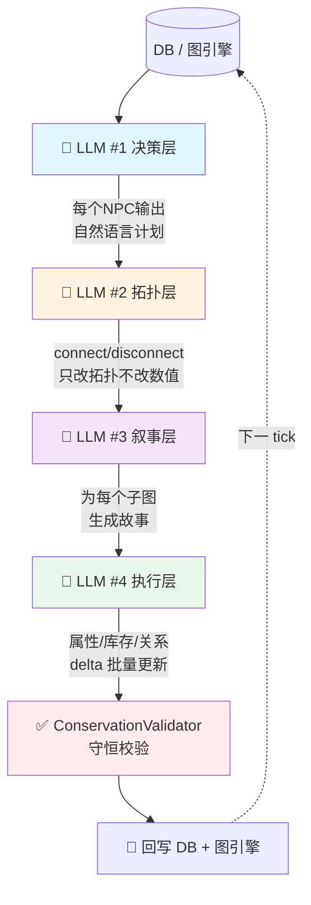
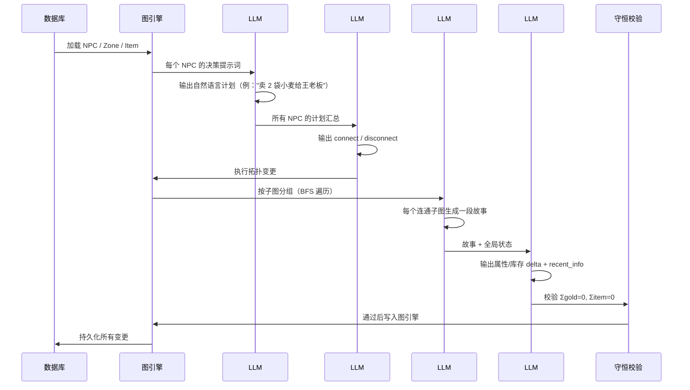

# AgentWorld

<p align="center">
  
</p>

> 基于 LLM 驱动的多 NPC 世界模拟引擎

一个由 **4 层 LLM 管线**驱动的多智能体世界模拟系统。NPC 在村庄、森林、集市、酒馆等区域中自主生活、交易、社交，所有行为由大模型实时决策，代码仅负责拓扑约束和守恒验证。

## 核心架构

### 4 层 LLM 管线（每 Tick）



### 完整生命周期



### 数据流

| 层级 | 输入 | 输出 | 一句话 |
|------|------|------|--------|
| **#1 决策** | NPC 状态 + 库存 + 位置 + 最近信息 | 自然语言计划 | 决定做什么 |
| **#2 拓扑** | 所有 NPC 计划 | `connect/disconnect` | 空间/社交移动 |
| **#3 叙事** | 拓扑变更后的子图结构 | 自然语言故事 | 发生了什么 |
| **#4 执行** | 故事 + 全局状态 | 属性/库存 delta | 落实变化 |

## 设计原则

- **LLM 是大脑，代码是骨架**：代码提供上下文和约束，LLM 做判断
- **自然语言 > 硬编码阈值**：属性状态注入 prompt，不写 `if vitality < 30`
- **纯拓扑边**：边只表示连通/断连，不携带接口语义
- **守恒校验**：ConservationValidator 保证经济系统不出错

## 项目结构

```
src/agent_world/
├── api/                  # HTTP API
├── cognition/            # LLM prompt 构建
├── config/               # 节点本体配置
├── db/                   # SQLite 持久化
├── entities/             # 实体模型（Entity / Zone / Item）
├── models/               # Pydantic 数据模型（NPC / World）
└── services/             # 核心管线
    ├── graph_npc_engine.py      # 主编排引擎
    ├── graph_engine.py          # 图拓扑引擎
    ├── graph_adapter.py         # DB → 图适配
    ├── intent_executor.py       # LLM #2 执行
    ├── interaction_layer.py     # LLM #3 故事生成
    ├── post_processor.py        # LLM #4 批量更新
    ├── conservation_validator.py # 守恒校验
    └── interaction_resolver.py  # LLM 调用封装

bin/
├── run_tick_report.py     # 单 tick 报告
└── run_20ticks.py         # 批量运行

docs/                      # 架构决策记录
```

## 世界设定

### 时间系统

- 春夏秋冬四季，起始于春·第 1 天 08:00
- 白天（06:00–21:00）：每 tick **30 分钟**
- 夜间（21:00–06:00）：每 tick **6 小时**

```mermaid
gantt
    title 昼夜推进规则
    dateFormat HH:mm
    axisFormat %H:%M

    section 白天
    活动期        :active, d1, 06:00, 15h
    section 夜间  
    加速睡眠期    :night, n1, 21:00, 9h
```

### 区域

`farm` · `market` · `tavern` · `barracks` · `library` · `temple` · `forest` · `village_square`

### NPC 属性

`vitality(体力)` · `satiety(饱腹)` · `mood(心情)` — 每 tick 自然衰减，交互/交易可提升

## 快速开始

```bash
pip install -r requirements.txt
python3 -c "from agent_world.db.db import init_db; init_db()"
python3 bin/run_tick_report.py           # 跑 1 tick
python3 bin/run_tick_report.py --save    # 保存 JSON trace
python3 bin/run_20ticks.py               # 批量跑 20 tick
```

## 技术栈

**Python 3.12+** · **Pydantic v2** · **MiniMax / Anthropic API** · **SQLite** · **自定义图引擎**

## License

MIT
