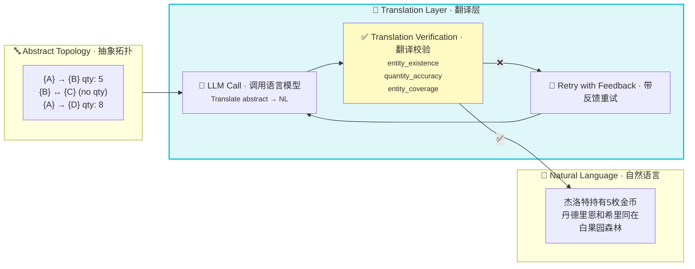
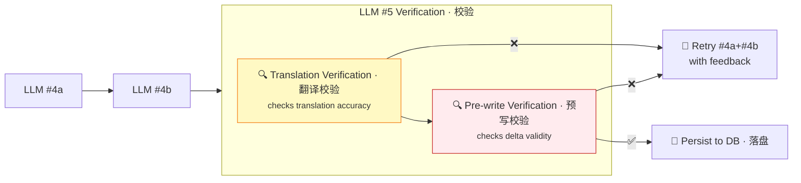

# AgentWorld

<p align="center">
  
  <br/>
  <em><b>Graph is not a feature. Graph is the system.</b></em>
  <br/>
  <em><b>图拓扑不是组件，是整个系统的骨架。</b></em>
</p>

---

> **EN**: A domain-agnostic, LLM-driven multi-agent simulation engine. The graph is the first principle: entities are nodes, relationships are edges, and LLMs reason over the topology to produce emergent behavior. All semantic knowledge lives in configuration — swap `domain.json` and the same engine simulates villages, protein networks, IoT grids, or fantasy economies.
>
> **CN**: 一个域无关的、LLM 驱动的多智能体仿真引擎。图拓扑是第一性原理——实体是节点、关系是边，LLM 在拓扑之上推理，产生涌现行为。所有语义知识都在配置文件中，切换 `domain.json`，同一个引擎可以模拟村庄、蛋白质网络、IoT 网格或幻想经济。

---

## Architecture Overview · 架构总览

```mermaid
flowchart LR
    GE["📦 Graph Engine<br/><small>pure topology</small>"]
    DB[("💾 DB /<br/>Persistence")]

    subgraph P["Seven-Stage LLM Pipeline · 七阶段 LLM 管线"]
        direction TB
        L1["🤖 LLM #1<br/>Planning<br/>规划"]
        L2["🤖 LLM #2<br/>Topo Structure<br/>拓扑结构"]
        IE["⚙️ Intent Executor<br/>(code)"]
        TL["🌉 Translation Layer<br/>翻译层<br/><small>abstact letters → NL</small>"]
        L3["🤖 LLM #3<br/>Narrative<br/>叙事"]
        L4a["🤖 LLM #4a<br/>Topo Delta<br/>拓扑增量"]
        CV["⚙️ Conservation<br/>Validator<br/><small>Σ=0 check</small>"]
        L4b["🤖 LLM #4b<br/>Content / Attr<br/>属性变化"]
        L5["🤖 LLM #5<br/>Verification<br/>校验"]
        retry{{"🔁 Retry #4a+#4b<br/>with feedback<br/>带反馈重试"}}
    end

    DB --> GE
    GE --> L1
    L1 -->|"NL plans"| L2
    L2 -->|"connect/disconnect"| IE
    IE -->|"topo changes"| TL
    TL -->|"translated topo"| L3
    L3 -->|"stories"| L4a
    L4a -->|"delta ops"| CV
    CV -->|"pass / partial"| L4b
    L4b -->|"attr + recent_info"| L5
    L5 -->|"✅ valid"| GE
    L5 -->|"❌ failed"| retry
    retry -.-> L4a

    GE --> DB

    style GE fill:#e0e0e0,stroke:#333
    style L1 fill:#e1f5fe
    style L2 fill:#fff3e0
    style IE fill:#f5f5f5,stroke:#999
    style TL fill:#e0f7fa,stroke:#00bcd4,stroke-width:2px
    style L3 fill:#f3e5f5
    style L4a fill:#e8f5e9
    style CV fill:#fff9c4
    style L4b fill:#e8f5e9
    style L5 fill:#ffebee
    style retry fill:#ffcdd2
    style DB fill:#e0e0e0
```



---

### Stage Details · 阶段详解

| Stage · 阶段 | Input · 输入 | Output · 输出 | 
|:------------|:-------------|:--------------|
| **#1 Plan · 规划** | Entity states + topology · 实体状态+拓扑 | Natural language plan · NL 计划 |
| **#2 Topo Structure · 拓扑结构** | All plans · 所有计划 | `connect`/`disconnect`/`set_qty` |
| **↳ Intent Executor (code)** | Topo ops · 拓扑操作 | Applied graph mutations · 图变更 |
| **🌉 Translation Layer · 翻译层** | Abstract topo letters · 抽象字母拓扑 | NL-translated topology · 自然语言拓扑 |
| **#3 Narrative · 叙事** | Translated topo + plans · 翻译后拓扑+计划 | Story per component · 逐连通分量故事 |
| **#4a Topo Delta · 拓扑增量** | Stories + graph state · 故事+图状态 | `delta`/`system_delta`/`recipe` ops |
| **↳ Conservation Validator · 守恒校验** | Delta ops | Pass / partial-fail (per group) |
| **#4b Content · 属性变化** | Stories + topo | `attr` deltas + `recent_info` |
| **#5 Verification · 校验** | All outputs · 全部输出 | Pass → persist / Fail → retry · 通过→落盘/失败→重试 |

---

## 🌉 Translation Layer · 翻译层详解

> **EN**: The engine's topology layer uses abstract letter labels (A, B, C...) for entities to prevent semantic label leakage. A dedicated Translation Layer converts these abstract symbols into natural language descriptions before feeding them to LLMs #3 and #4a.
>
> **CN**: 引擎的拓扑层使用抽象字母标签（A, B, C...）标记实体，防止语义标签泄漏。翻译层在将拓扑输入 LLM #3 和 #4a 之前，将这些抽象符号转换为自然语言描述。



### Why Abstract Letters? · 为什么用抽象字母？

> **EN**: If the graph engine output `"杰洛特 → 金币 qty: 5"`, LLM #3 might treat `"杰洛特"` as a narrative entity, not a graph node — causing entity hallucinations. Abstract letters force LLMs to treat topology as pure structure, then the translation layer converts it to readable text with **verifiable accuracy**.
>
> **CN**: 如果图引擎直接输出 `"杰洛特 → 金币 qty: 5"`，LLM #3 可能把 `"杰洛特"` 当作叙事角色而非图节点——导致实体幻觉。抽象字母强制 LLM 将拓扑视为纯结构，再由翻译层转换为**可校验准确性**的自然语言。

### Translation Verification · 翻译校验

| Check · 校验项 | What it verifies · 验证内容 |
|:---------------|:---------------------------|
| **entity_existence** · 实体存在性 | Every name in the NL output maps to a real graph entity · NL 中的每个名称对应真实图节点 |
| **quantity_accuracy** · 数量准确 | Numeric quantities in NL match the edge quantities in the graph · NL 中的数值与边 qty 一致 |
| **entity_coverage** · 实体覆盖 | All graph entities appear in the NL output · 所有图节点在 NL 中出现 |

All checks run against the **graph engine ground truth**. Failed checks trigger a retry loop with corrective feedback.

所有校验对照**图引擎事实**进行。失败触发带修正反馈的重试循环。

---

## Graph Is the System · 图即系统

> **EN**: Every entity in AgentWorld is a first-class graph node. Every relationship is an edge with a quantity. Queries that require scanning in traditional simulations become edge traversals.
>
> **CN**: AgentWorld 中的每个实体都是一等图节点。每个关系都是带数量的边。传统仿真中需要全表扫描的查询，在图模型中变成边遍历。

| Query · 查询 | Traditional · 传统方式 | Graph · 图方式 |
|:------------|:---------------------|:--------------|
| Where is X? · X 在哪？ | Read `X.current_region` · 读字段 | `X.get_edge("region").target` |
| Who's in Y? · 谁在 Y？ | Scan all entities · 全量扫描 | `Y.get_neighbors()` filter by type · 邻居过滤 |
| What does X hold? · X 有什么？ | Read `X.inventory[]` · 读数组 | Traverse `X→R` edges with qty · 遍历出边 |
| Can X produce Z? · X 能造 Z？ | Check recipe permissions · 查配方 | `X.has_edge("can_produce", Z)` |

---

## Verification System · 校验系统

> **EN**: A two-layer verification system runs before any data is persisted. Both layers are driven by a **mask** in `domain.json`.
>
> **CN**: 两层校验系统在数据落盘前运行。两层的激活配置都来自 `domain.json` 中的 **mask**。



### Verification Registry · 校验注册器

| Index | Check · 校验项 | Layer · 所在层 | Description · 描述 |
|:-----:|:--------------|:--------------|:------------------|
| 0 | **entity_existence** | Translation + Pre-write | All referenced entities exist · 所有引用实体存在 |
| 1 | **quantity_accuracy** | Translation | NL quantities match ground truth · NL 数量与事实一致 |
| 2 | **capacity_upper_bound** | Pre-write | Negative deltas ≤ edge qty · 负增量不超过边数量 |
| 3 | **entity_coverage** | Translation | All entities appear in NL · 所有实体在 NL 中出现 |
| 4 | **direction_pairing** | Pre-write (LLM) | Bidirectional flows alternate · 双向流交替方向 |
| 5 | **story_consistency** | Pre-write (LLM) | Ops align with story · 操作与故事一致 |

---

## Slot-Based Prompt Assembly · 槽位式 Prompt 组装

> **EN**: Each LLM prompt is assembled from ordered slots. Each slot has a provider type. Swapping worldviews = swapping `domain.json` — the slot structure rarely changes.
>
> **CN**: 每个 LLM prompt 由有序槽位组装而成。每个槽位有 provider 类型。切换世界观 = 切换 `domain.json`——槽位结构几乎不变。

```
prompt = [
  ("time_info",         "runtime"),     # ← clock · 时钟
  ("survival_needs",    "content"),     # ← domain.json
  ("entity_identity",   "content"),     # ← domain.json
  ("label_mapping",     "topology"),    # ← graph engine
  ("topology_graph",    "topology"),    # ← graph engine (+ TL)
  ("decision_guidance", "content"),     # ← domain.json
]
```

**Three providers · 三类提供者：**
- `"content"` — Domain-specific text from `domain.json` via `DomainAdapter.render_slot()`
- `"topology"` — Engine-rendered data (labels, edges, constraints) — optionally through Translation Layer
- `"runtime"` — Live data (clock, feedback)

---

## Conservation Validation · 度守恒

> **EN**: Inspired by thermodynamics. Internal flows must conserve (Σ=0). System-boundary flows may not.
>
> **CN**: 受热力学启发。内部流通必须守恒（Σ=0）。系统边界的流通可以不守恒。

```
                    ┌──────────────────────┐
                    │  Internal (Σ=0)      │
                    │   Entity A ↔ Entity B│  ← trades conserved · 交易守恒
                    │   Recipe transforms  │  ← balanced · 配方自平衡
                    └────────┬─────────────┘
                             │
                    System boundary ──────── → Σ ≠ 0
                             │
                    ┌────────┴─────────────┐
                    │  Environment (Σ≠0)   │
                    │   Consumption · 消耗  │
                    │   Gathering · 采集    │
                    │   Entropy decay · 熵衰减
                    └──────────────────────┘
```

---

## Design Principles · 设计原则

### 1. LLM is the Brain, Code is the Skeleton · LLM 是大脑，代码是骨架

```
Code: builds prompt, validates format, executes LLM decisions
LLM:  understands state, makes judgments, creates narrative
Code does not make decisions. It provides information and boundaries.
```

### 2. Natural Language > Hardcoded Thresholds · 自然语言 > 硬编码阈值

```python
# ❌ Anti-pattern · 反模式:
if entity.vitality < 30: go_rest()

# ✅ Current · 当前做法:
# Prompt injects: ⚠️ vitality < 30: extreme fatigue, must rest
# LLM decides: where? how long? what after?
```

### 3. Topology–Content Decoupling · 拓扑与内容解耦

```python
# ❌ Forbidden · 禁止 — engine knows entity types:
if entity.type_id == "NPC": ...

# ✅ Allowed · 允许 — engine reads type from config:
if NODE_ONTOLOGY[ent.type_id].get("terminal"): ...
```

### 4. Layered Constraint Spectrum · 分层约束谱

```
LOOSE ──────────────── TIGHT
#1 (Plan)  #3 (Story)     #2 (Topo)   #4 (Post)
free text  free narrative  JSON schema  JSON schema
```

---

## Project Structure · 项目结构

```
src/agent_world/
├── api/                    # HTTP API
├── cognition/              # Per-entity prompt construction
├── config/                 # Domain configuration
│   ├── domain.json         # **ALL domain content** (swap for new world)
│   └── node_config.json    # Node type ontology
├── db/                     # SQLite persistence
├── entities/               # Entity models
├── models/                 # Pydantic data models
└── services/               # Core pipeline
    ├── graph_npc_engine.py         # Main orchestration engine
    ├── graph_engine.py             # 🔷 Pure graph topology engine
    ├── graph_adapter.py            # DB → Graph adapter
    ├── domain_adapter.py           # Renders slots from domain.json
    ├── prompt_assembler.py         # Slot-based prompt assembly (+ TL)
    ├── interaction_resolver.py     # LLM API wrapper
    ├── interaction_layer.py        # LLM #3 story generation
    ├── intent_executor.py          # LLM #2 execution
    ├── post_processor.py           # LLM #4 batch update
    ├── conservation_validator.py   # Σ=0 validation
    ├── verification_registry.py    # 🔷 Centralized check registration
    └── verification_layer.py       # LLM #5 verification orchestrator
```

---

## Creating Your Own World · 创建你的世界

```bash
# 1. Write config/domain.json — entities, regions, recipes, prompt slots
# 2. Update config/node_config.json — node types, ontology
# 3. Run — engine reads config, no code changes
```

> See [`WITCHER_WORLD.md`](WITCHER_WORLD.md) for the built-in example domain (Witcher universe).

---

## Quick Start · 快速开始

```bash
pip install -r requirements.txt

# Initialize database · 初始化数据库
python3 -c "from agent_world.db.db import init_db; init_db()"

# Run a single tick with real LLM calls · 运行一个真实 LLM tick
python3 run_minimal_tick.py
```

---

## Technical Stack · 技术栈

**Python 3.12+** · **Pydantic v2** · **MiniMax / OpenAI API** · **SQLite** · **Custom Graph Engine**

---

## License · 许可证

MIT
